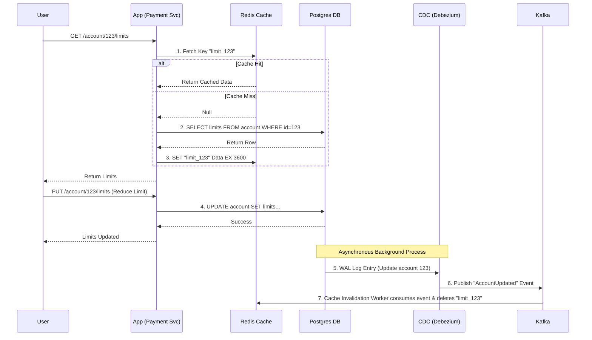

# Caching Strategies and Patterns

## Overview

Caching is the process of storing copies of data in a temporary storage location (usually memory) so that future requests for that data can be served faster. In enterprise banking, where strict Service Level Agreements (SLAs) dictate response times under 50 milliseconds, pulling data from a relational database on every request is impossible. A database query might take 10-50ms; an in-memory cache lookup takes 0.5ms.

For Staff and Principal Engineers, caching is a treacherous topic. Interviewers know that "putting a cache in front of it" is the easy answer to any performance problem. The hard part—and what you will be tested on—is **Cache Invalidation**. Phil Karlton famously said, "There are only two hard things in Computer Science: cache invalidation and naming things." 

In financial systems, returning an outdated account balance or an old foreign exchange (FX) rate because of a stale cache can result in millions of dollars in arbitrage losses or regulatory reporting failures. You must prove you understand how to keep caches consistent with the source of truth, how to prevent cache stampedes, and when *not* to use a cache.

## Foundational Concepts

### Multi-Level Caching (The Memory Hierarchy)
Caching is not just Redis. It happens at every layer of the stack.
1.  **L1/L2/L3 CPU Cache**: Hardware level. Measured in nanoseconds.
2.  **Application In-Memory Cache (Local)**: Storing objects inside the JVM heap (e.g., Caffeine, Guava, ConcurrentHashMap). Extremely fast (microseconds), but state is not shared across microservice instances, leading to cache drift.
3.  **Distributed Cache (Remote)**: Redis, Memcached, Hazelcast. A separate cluster of memory-optimized servers. Accessed via network (milliseconds). Slower than local cache, but all application instances see a unified, consistent state.
4.  **Database Cache**: RDBMS internal buffer pools or NoSQL memory spaces.
5.  **CDN (Content Delivery Network)**: Caches static assets (HTML, JS, images) or even edge-compiled APIs geographically close to the user (e.g., Cloudflare, Akamai).

### Cache Eviction Policies
Memory is finite (and expensive). When the cache is full, what data do you delete to make room for new data?
*   **LRU (Least Recently Used)**: The most common. Evicts the item that has not been accessed for the longest time. Assumes data accessed recently will likely be accessed again.
*   **LFU (Least Frequently Used)**: Evicts items accessed the fewest total number of times. Complex to implement efficiently because it requires counting every access.
*   **FIFO (First In, First Out)**: Evicts the oldest item, regardless of how often it's used. Rare in modern caching.
*   **TTL (Time To Live)**: Items expire after a fixed duration (e.g., 5 minutes) regardless of access patterns. Crucial for data that naturally becomes stale, like stock prices.

## Technical Deep Dive

### Cache Update Patterns (How Data Gets into the Cache)

The pattern you choose determines the consistency guarantees of your system.

#### 1. Cache-Aside (Lazy Loading)
The most common pattern. The application code manages the cache.
*   **Flow**: App checks Cache -> If Miss: App queries DB -> App writes to Cache -> Return data.
*   **Pros**: Cache only contains requested data (efficient memory use). Database failures don't crash the read path if data is cached.
*   **Cons**: First request is slow (cache miss penalty). High risk of staleness if data changes in the DB without invalidating the cache.
*   **Banking Use Case**: User profile settings, application configurations, reference data (country codes).

#### 2. Read-Through
The application queries the Cache directly as if it were the DB. The cache library (or an abstraction layer) is responsible for fetching data from the DB if it's missing.
*   **Pros**: Simplifies application code. Transparent to the developer.
*   **Cons**: Requires tightly coupling the cache provider to the database schema.

#### 3. Write-Through
The application writes data to the Cache. The Cache *synchronously* writes that data to the DB before returning success to the application.
*   **Pros**: Absolute highest consistency. Data in the cache is *never* stale.
*   **Cons**: Every write suffers the latency of two network hops (Cache + DB). Slow writes.
*   **Banking Use Case**: High-security session management, where reading stale permissions is catastrophic, but write volume is moderate.

#### 4. Write-Behind (Write-Back)
The application writes data to the Cache and immediately returns success. The Cache *asynchronously* writes the data to the DB in the background.
*   **Pros**: Extremely fast writes. Caches can batch database writes (compressing 10 updates into 1 bulk update), vastly reducing database load.
*   **Cons**: **HIGH RISK OF DATA LOSS.** If the cache node crashes before the background write completes, data is permanently lost.
*   **Banking Use Case**: *Never* for ledgers or payments. Acceptable for analytics tracking, clickstreams, or non-critical audit logging where slight data loss is acceptable for massive write throughput.

### Cache Invalidation Strategies

Invalidating a record when the underlying database changes is the hardest problem.

1.  **TTL (Time-To-Live)**: The simplest approach. Set a TTL of 60 seconds. You accept that data might be stale for up to 60 seconds.
2.  **Explicit Invalidation**: When the application updates the DB, it explicitly sends a `DEL` command to Redis.
    *   *The Danger*: If the `DEL` command fails due to a network blip, the cache remains permanently stale until the TTL expires (which might be weeks).
3.  **Active Invalidation via CDC (Change Data Capture)**: The architectural gold standard. Use a tool like Debezium to tail the database transaction log (WAL). When a row changes, Debezium publishes an event to Kafka. A cache-invalidation microservice consumes this event and deletes the cache key. This decouples the application from cache management and guarantees eventual consistency.

### Cache Stampedes (Thundering Herd) and Prevention

A Cache Stampede occurs when a highly requested cache key expires (e.g., the Apple stock price page during an earnings call).
1.  **T0**: Key expires.
2.  **T1**: 10,000 parallel user requests ask for the key. All see a Cache Miss.
3.  **T2**: All 10,000 threads simultaneously query the database to fetch the Apple stock data.
4.  **T3**: The database CPU spikes to 100% and crashes.

**Prevention Strategies:**
*   **Mutex/Distributed Locking**: If there's a cache miss, the thread must acquire a lock (e.g., Redis `SETNX`) for that specific key. Only the thread with the lock queries the DB. The other 9,999 threads wait or retry. Once the DB query finishes, the thread populates the cache and releases the lock.
*   **Probabilistic Early Expiration (PERF)**: The application has a small probability of treating a cached item as "expired" *before* its actual TTL. This probability increases as the TTL approaches zero. One lucky thread is tricked into fetching the new value in the background while others continue reading the stale value, preventing a cliff-edge stampede.

## Visual Representations

### The Cache-Aside Pattern with CDC Invalidation



### Multilevel Caching Architecture

```mermaid
flowchart TD
    subgraph Client
        Browser[Browser Cache]
    end
    
    subgraph Edge
        CDN[Cloudflare CDN]
        API_GW[API Gateway Cache]
    end
    
    subgraph Application Tier
        App1[Service Instance 1 \n (Caffeine Local Cache L1)]
        App2[Service Instance 2 \n (Caffeine Local Cache L1)]
    end
    
    subgraph Distributed Data Tier
        Redis[(Redis Cluster L2)]
        DB[(PostgreSQL)]
    end

    Browser -->|HTTP| CDN
    CDN -->|HTTPS| API_GW
    API_GW --> App1
    API_GW --> App2
    
    App1 -->|Miss| Redis
    App2 -->|Miss| Redis
    
    Redis -->|Miss| DB
```

## Code/Configuration Examples

### Preventing Cache Stampede with Distributed Locks (Java/Redis)

This snippet demonstrates using Redisson (a Redis Java client) to acquire a distributed lock when a cache miss occurs. This prevents 10,000 threads from slamming the database simultaneously.

```java
public class ReferenceDataService {

    private final RedissonClient redisson;
    private final DatabaseRepository dbRepository;

    public FxRate getExchangeRate(String currencyPair) {
        String cacheKey = "fx:rate:" + currencyPair;
        
        // 1. Try to get from Cache
        RBucket<FxRate> bucket = redisson.getBucket(cacheKey);
        FxRate rate = bucket.get();
        
        if (rate != null) {
            return rate; // Cache Hit
        }

        // Cache Miss!
        // 2. Prevent Stampede by acquiring a lock specific to this currency pair
        String lockKey = "lock:fx:rate:" + currencyPair;
        RLock lock = redisson.getLock(lockKey);

        try {
            // Wait up to 2 seconds for the lock. If acquired, hold it for max 10 seconds.
            boolean isLocked = lock.tryLock(2, 10, TimeUnit.SECONDS);
            if (isLocked) {
                try {
                    // Double-check locking: Another thread might have populated the cache while we waited
                    rate = bucket.get();
                    if (rate == null) {
                        // 3. We have the lock, and the cache is still empty. Query DB.
                        rate = dbRepository.getLatestRate(currencyPair);
                        
                        // 4. Update the cache with a TTL
                        bucket.set(rate, 5, TimeUnit.MINUTES);
                    }
                } finally {
                    lock.unlock(); // Always unlock in a finally block!
                }
            } else {
                // Could not acquire lock (another thread is updating it right now).
                // Instead of failing or hitting the DB, we can:
                // a) Sleep and retry fetching from cache
                // b) Return a slightly stale, previously known value (if acceptable)
                throw new TransientException("System under heavy load updating FX rates");
            }
        } catch (InterruptedException e) {
             Thread.currentThread().interrupt();
             throw new RuntimeException("Interrupted while waiting for lock", e);
        }

        return rate;
    }
}
```

## Interview Questions & Model Answers

**Q1: What is a Cache Stampede (or Thundering Herd), and how do you prevent it in a highly concurrent system?**
*Answer*: A cache stampede occurs when a highly requested, computationally expensive cache key expires (or is evicted). Suddenly, thousands of concurrent requests miss the cache and simultaneously query the underlying database, overwhelming and potentially crashing it. To prevent this, I use Distributed Mutex Locks. When a cache miss occurs, the application threads attempt to acquire a Redis lock for that specific key. Only the thread that successfully acquires the lock queries the database and populates the cache. The other threads either wait (using exponential backoff) or return a stale cached value if the business logic permits. Another advanced technique is Probabilistic Early Expiration, where threads randomly refresh the cache *before* it strictly expires.

**Q2: In a microservices architecture handling millions of user profiles, how do you ensure the distributed cache remains consistent with the PostgreSQL database?**
*Answer*: Relying on the application to update both the DB and the Cache (Dual-Write) is dangerous because network calls can fail, leaving the system permanently inconsistent. The most robust enterprise pattern is active invalidation using Change Data Capture (CDC). I would deploy Debezium to tail the PostgreSQL Write-Ahead Log (WAL). When a user profile is updated, Debezium streams an `UpdateEvent` to Kafka. A dedicated cache-invalidation service consumes this event and deletes the corresponding key in Redis. The next time the application requests that profile, it misses the cache, fetches the fresh data from PostgreSQL, and repopulates Redis. Always configure a TTL as a final safety net.

**Q3: Compare Write-Through and Write-Behind caching. When would you use Write-Behind in a banking context?**
*Answer*: Write-Through involves the application synchronously writing to the cache, which then synchronously writes to the database before returning. It guarantees consistency but suffers high latency. Write-Behind (or Write-Back) involves the application writing to the cache and returning immediately, while the cache asynchronously batches writes to the DB. Write-Behind is extremely fast but risks data loss if the cache node crashes before flushing to the DB. In a strict banking context (like payment ledgers), I would *never* use Write-Behind because financial data loss is unacceptable. However, I *would* use Write-Behind for non-critical high-volume telemetry, such as tracking user clicks on promotional banners, where high throughput is required and losing a few seconds of data during a crash is an acceptable business risk.

**Q4: We have a Redis cluster caching reference data (e.g., Bank routing numbers) which changes maybe once a month. The DB keeps crashing due to high load anyway. Why?**
*Answer*: This is a classic "Hot Key" problem. If thousands of requests per second are hitting a single key in Redis, the performance bottlenecks on the network interface and single-threaded CPU of the *specific Redis node* that holds that partition. The DB is crashing because the Redis node becomes unresponsive, causing massive cache timeouts and falling back to the DB. The solution is Multi-Level Caching. I would implement an in-memory L1 cache (like Caffeine in Java) inside each application instance with a short TTL (e.g., 60 seconds) to serve the hot key directly from the JVM heap, completely removing the network hop to Redis and alleviating the DB load.

## Real-World Enterprise Scenarios

**Scenario: Live Foreign Exchange (FX) Rate Ticker API**
*   **Context**: A trading platform displaying real-time currency conversion rates (USD->EUR) to millions of mobile app users. The DB cannot handle 100,000 QPS.
*   **Architecture Requirements**: The rates change every second. Stale data (even 5 seconds old) causes significant financial loss for the institution.
*   **Strategy**: We cannot use TTL-based cache-aside because we cannot tolerate 5 seconds of staleness. We use a **Write-Through** or **Event-Driven Push** pattern. The quantitative trading engine calculates the new rate and immediately PUSHES the update into Redis and publishes an event. The API servers maintain Server-Sent Events (SSE) or WebSockets with the mobile clients. The API servers subscribe to Redis Pub/Sub, receive the new rate instantly, and push it directly to the users' screens. The Redis cache serves as the extremely fast, highly available read model.

## Common Pitfalls & Best Practices

**Pitfalls:**
*   **Infinite TTLs**: Storing data in a cache without an expiration time. If your invalidation logic has a bug, the data is permanently corrupted. Always use a TTL, even if it's 24 hours.
*   **Caching Large Objects**: Don't serialize a 5MB JSON response and shove it into Redis. Network transport time and deserialization CPU cost will negate the benefits of caching. Only cache small, frequently accessed, computationally expensive DTOs.
*   **Treating Redis as a Primary Database**: Redis can persist to disk, but it is primarily an in-memory datastore. Do not use it as the source of truth for critical relational data without understanding the replication risks and asynchronous disk flushing behaviors.

**Best Practices:**
*   **Cache Invalidation != Cache Update**: It is generally much safer to *delete* a cache key when data changes rather than trying to perform a complex partial *update* in the cache. Let the next `GET` request fetch the clean, completely rebuilt object from the DB.
*   **Graceful Degradation**: Always wrap your cache calls in a `try-catch`. If Redis goes down, the application should log the error, emit an alert, and fall back to querying the database directly (perhaps with an aggressive rate-limiter applied to prevent crashing the DB). The system must survive the loss of the cache tier.

## Comparison Tables

| Pattern | Read Speed | Write Latency | Data Consistency | Complexity |
| :--- | :--- | :--- | :--- | :--- |
| **Cache-Aside** | Fast | Fast (writes to DB only) | Medium (Risk of staleness) | Low |
| **Write-Through** | Fast | Slow (Two synchronous hops)| High (Always consistent) | Medium |
| **Write-Behind** | Fast | Fastest (Async to DB) | Low (Data loss risk on crash)| High |
| **CDC Invalidation**| Fast | Medium | Medium-High (Eventual) | High |

| Cache Tier | Storage Location | Latency | Shared across Instances? | Data Size Limit |
| :--- | :--- | :--- | :--- | :--- |
| **L1 (Local)** | JVM Heap (Caffeine) | ~1 Microsecond | No (Cache Drift risk) | MBs (Limited by RAM) |
| **L2 (Distributed)**| Redis / Memcached | ~1-5 Milliseconds | Yes | GBs / TBs (Cluster) |
| **L3 (CDN)** | Edge Servers | ~10-50 Milliseconds | Yes (Global) | TBs / PBs |

## Key Takeaways

*   **Caching is a trade-off**: You are trading memory capacity and architectural complexity for lower read latency.
*   **Avoid Hot Keys**: Identify keys accessed disproportionately often and mitigate them with L1 local caching.
*   **Stampedes kill databases**: Never allow thousands of threads to query a database simultaneously upon a cache miss. Use distributed locks.
*   **CDC is the gold standard for invalidation**: Decouple cache invalidation from application logic by using transaction log tailing for eventual consistency.
*   **Always use a TTL**: It is the ultimate safety net against bugs in invalidation logic.

## Further Reading
*   [Redis Documentation - Eviction Policies](https://redis.io/topics/lru-cache)
*   [Scaling Memcache at Facebook (Whitepaper)](https://www.usenix.org/system/files/conference/nsdi13/nsdi13-final170_update.pdf)
*   [Preventing Cache Stampedes with Probabilistic Early Expiration](https://en.wikipedia.org/wiki/Cache_stampede#Probabilistic_early_expiration)
*   [Debezium CDC for Cache Invalidation](https://debezium.io/blog/2018/12/05/updating-caches-with-debezium/)
