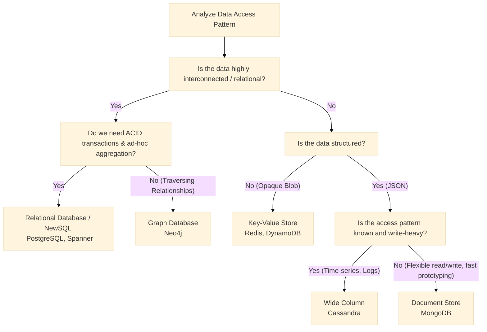

# NoSQL, NewSQL, and Polyglot Persistence

## Overview

For decades, the Relational Database Management System (RDBMS) was the only tool in the shed. If you needed to scale, you bought a bigger server. However, the explosion of web-scale traffic (social media, IoT telemetry, global e-commerce) revealed the physical limits of single-node ACID databases. NoSQL (Not Only SQL) databases emerged to solve the horizontal scaling problem by relaxing ACID guarantees, adopting flexible schemas, and embracing distributed systems principles (CAP Theorem).

More recently, NewSQL databases like Google Spanner and CockroachDB have emerged, promising the Holy Grail: the horizontal scalability of NoSQL combined with the strong ACID guarantees of traditional RDBMS. 

For a Staff/Principal Engineer, especially in banking, understanding *when* not to use a relational database is a critical skill. Choosing NoSQL for a financial ledger is a catastrophic error; choosing an RDBMS to store billions of unstructured clickstream telemetry data points is an incredibly expensive mistake. You are expected to navigate the Polyglot Persistence landscape—using the right database for the right job within a microservices architecture.

## Foundational Concepts

### The Driving Forces behind NoSQL

1.  **Impedance Mismatch**: Relational tables don't naturally map to Object-Oriented programming objects. Saving a complex `User` object might require writing to 5 different tables. NoSQL (specifically Document stores) allows storing the entire object graph as a single JSON document.
2.  **Schema Flexibility**: In an RDBMS, adding a column to a 10-terabyte table requires a massive locking operation (migration) that can cause downtime. NoSQL is schema-less; every record can have different fields.
3.  **Horizontal Scalability**: NoSQL databases were built from day one to run on commodity clusters (Hash Rings, Consistent Hashing), favoring Availability and Partition Tolerance (AP) over strict Consistency.

## Technical Deep Dive: The NoSQL Families

There are four primary families of NoSQL databases, each optimized for drastically different access patterns.

### 1. Key-Value Stores (Redis, DynamoDB, Memcached)

*   **Data Model**: The simplest model. A massive hash map (dictionary). Every item is stored as a Key and a Value (which is an opaque blob to the database).
*   **Strengths**: Blistering speed (O(1) lookups). In-memory variants (Redis) provide sub-millisecond latency. Highly partitionable.
*   **Weaknesses**: You can only query by Key. If you store `{ "id": 123, "name": "Alice", "age": 30 }` under the key `user:123`, you *cannot* efficiently query "Find all users older than 25".
*   **Enterprise Banking Use Cases**: 
    - Distributed session management (storing auth tokens).
    - Rate limiting counters (e.g., failed login attempts).
    - Real-time Leaderboards or highly volatile caches.
    - Idempotency key stores (preventing duplicate payments).

### 2. Document Stores (MongoDB, Couchbase, Firestore)

*   **Data Model**: Values are stored as semi-structured documents (usually JSON or BSON). Crucially, the database *understands* the internal structure of the document, allowing you to index and query sub-fields.
*   **Strengths**: Schema flexibility. Excellent alignment with application code. You can fetch a complex object (a user, their addresses, and their preferences) in a single disk read without complex SQL Joins.
*   **Weaknesses**: Poor for connecting disparate data (No Joins). If you nest data, updating it can be slow. If you duplicate data (denormalization) to avoid joins, you must update multiple documents when data changes (Consistency issues).
*   **Enterprise Banking Use Cases**:
    - Product Catalogs (where a credit card and a mortgage have entirely different attributes).
    - User Profiles and dynamic application preferences.
    - Content Management Systems (storing marketing material).

### 3. Wide-Column Stores (Apache Cassandra, ScyllaDB, HBase)

*   **Data Model**: Often confused with tabular relational DBs, but totally different. Data is stored in column families. Instead of storing data row-by-row on disk, it stores data column-by-column. 
*   **Partitioning**: Data is distributed using a Partition Key (dictates which node holds the data) and ordered on that node using a Clustering Key.
*   **Strengths**: Incredible Write throughput. Cassandra processes writes by simply appending to a commit log and dumping an in-memory structure (Memtable) to disk (SSTable) sequentially. Highly available across multiple global datacenters.
*   **Weaknesses**: You must design your schema based *exactly* on the queries you will run. Ad-hoc queries or filtering by non-partition keys are impossibly slow (requires full cluster scans).
*   **Enterprise Banking Use Cases**:
    - Time-series data (e.g., storing stock market ticks).
    - Audit logging (append-only, high volume).
    - IoT telemetry from ATMs (temperature, vault status).

### 4. Graph Databases (Neo4j, Amazon Neptune)

*   **Data Model**: Data is stored as Nodes (entities) and Edges (relationships). Both can have properties.
*   **Strengths**: Blazing fast at traversing deeply nested relationships. Finding "Friends of Friends of Friends" takes milliseconds, whereas it would require crippling recursive `JOIN`s in SQL.
*   **Weaknesses**: Poor at bulk aggregations (e.g., "Sum all account balances"). Difficult to scale out (sharding a highly interconnected graph across multiple machines ruins query performance).
*   **Enterprise Banking Use Cases**:
    - **Fraud Detection**: Identifying rings of synthetic identities sharing the same phone number or IP address.
    - Recommendation Engines (e.g., "Customers who bought this fund also bought...").
    - Anti-Money Laundering (AML) transaction tracing.

## Technical Deep Dive: NewSQL

NewSQL aims to provide the best of both worlds.

*   **The Promise**: You get a standard SQL interface, strong ACID transactions across multiple partitions, *and* automatic horizontal sharding and replication.
*   **How it Works (Google Spanner & TrueTime)**:
    - To provide strict global linearizability (strong consistency) without crippling latency, Spanner uses TrueTime. Every data center is equipped with GPS receivers and atomic clocks.
    - TrueTime provides a highly accurate time interval (e.g., `[now - 4ms, now + 4ms]`). Spanner intentionally injects a tiny artificial delay (wait out the uncertainty interval) before committing a transaction. This guarantees that if Transaction B starts after Transaction A commits, B's timestamp is mathematically guaranteed to be greater than A's timestamp, regardless of which continent the servers are on.
*   **How it Works (CockroachDB)**:
    - Built on top of a highly optimized Key-Value store (RocksDB). It breaks SQL tables into small ranges (chunks) and replicates them across nodes using the Raft consensus algorithm.
*   **Trade-offs**: Latency. While horizontally scalable, cross-shard ACID transactions require network coordination (often 2PC), meaning write latency is higher than local RDBMS or AP NoSQL stores.

## Visual Representations

### NoSQL Selection Decision Matrix



### Cassandra Wide-Column Architecture (SSTables and Memtables)

```mermaid
flowchart TD
    subgraph Cassandra Node
        RAM[In-Memory Memtable]
        CommitLog[Append-Only Commit Log]
        
        Disk1[SSTable 1 - Immutable]
        Disk2[SSTable 2 - Immutable]
        Disk3[SSTable 3 - Immutable]
        
        Compaction[Background Compaction Process]
    end
    
    Client -->|1. Write Request| Node
    
    Node -.-> |2. Append| CommitLog
    Node -.-> |3. Write| RAM
    
    RAM -.->|4. Flush when full (Fast Sequential Write)| Disk3
    
    Disk1 --> Compaction
    Disk2 --> Compaction
    Compaction -.-> |5. Merges old files| NewDisk[New Merged SSTable]
```

## Code/Configuration Examples

### Designing a Cassandra Schema based on Queries

In an RDBMS, you design the schema based on entities (normalization). In Wide-Column stores like Cassandra (CQL), you **must** design the table based on the exact query you intend to run.

**Scenario**: We need to query all ATM transactions for a specific branch, ordered by time.

```sql
-- ANTI-PATTERN: Designing like an RDBMS
CREATE TABLE atm_transactions_bad (
    transaction_id uuid PRIMARY KEY,
    branch_id int,
    amount decimal,
    timestamp timestamp
);
-- To find transactions for branch 101, Cassandra would have to scan every node in the cluster. (Disaster)

-- ENTERPRISE PATTERN: Designing for the Query
CREATE TABLE transactions_by_branch (
    branch_id int,               -- Partition Key: Data for one branch lives on one node
    year_month text,             -- Partition Key (Bucketing to prevent the partition from growing infinitely)
    timestamp timestamp,         -- Clustering Key: Data is stored sorted by this on disk
    transaction_id uuid,
    amount decimal,
    PRIMARY KEY ((branch_id, year_month), timestamp)
) WITH CLUSTERING ORDER BY (timestamp DESC);

-- FAST QUERY: Hits exactly one node, reads sequentially from disk.
SELECT * FROM transactions_by_branch 
WHERE branch_id = 101 AND year_month = '2023-10';
```

## Interview Questions & Model Answers

**Q1: We are moving our monolithic user database to microservices. Service A needs relational data, Service B needs to store massive amounts of unstructured JSON logs, and Service C manages user sessions. How do you approach the data layer?**
*Answer*: I would implement Polyglot Persistence, selecting the optimal database type for each bounded context. Pushing everything into a single massive Oracle database creates a coupling bottleneck. 
*   For Service A (e.g., Billing or Core Accounts), I would use an RDBMS like PostgreSQL for strict ACID compliance. 
*   For Service B (Logs), an RDBMS would choke on the write volume and schema changes. I would use a Document Store (MongoDB) or, if the volume is extreme and append-only, a Wide-Column store like Cassandra. 
*   For Service C (Sessions), which requires sub-millisecond lookups based purely on a Session ID, I would use an In-Memory Key-Value store like Redis.

**Q2: What is the biggest drawback of using a Document Store like MongoDB over an RDBMS?**
*Answer*: The primary drawback is the lack of robust `JOIN` operations and enforcement of normalized data integrity. In MongoDB, if a User has many Addresses, you typically embed the Addresses inside the User document to avoid joins and achieve high performance on read. However, if that Address needs to be referenced by a completely different Order document, you are forced to duplicate the address data. If the user updates their address, the application must orchestrate updates across multiple documents. If the application crashes halfway, the database is in an inconsistent state, lacking the atomicity of a multi-table SQL transaction.

**Q3: Explain how Cassandra achieves such incredibly high write throughput compared to a traditional SQL database.**
*Answer*: A traditional RDBMS has to find the exact row on the disk using a B-Tree, update it in place, and manage complex locking to ensure ACID properties, leading to slow random disk I/O. Cassandra is essentially a massive distributed append-only log. When a write comes in, Cassandra writes it to a sequential Commit Log on disk (for durability) and writes it into an in-memory structure called a Memtable. The client gets an immediate success response. That's it. It requires no disk seeks or locking. When the Memtable fills up, Cassandra flushes it sequentially to disk as an immutable SSTable file. Background compaction merges these files over time. This architecture turns all random writes into blazing-fast sequential writes.

**Q4: Google Spanner offers global ACID transactions. Why wouldn't we just use it for everything instead of choosing between NoSQL and PostgreSQL?**
*Answer*: Three reasons: Cost, Cloud-lock-in, and Latency. Spanner requires specialized hardware (atomic clocks and GPS receivers) and is heavily proprietary to Google Cloud. While CockroachDB offers a cloud-agnostic NewSQL alternative, both systems suffer from higher latency for writes compared to a local PostgreSQL instance or an AP NoSQL database. A write transaction in Spanner often requires 2PC across multiple Raft groups spanning continents. The speed of light dictates that coordinating a transaction between Tokyo and New York will add 100-200ms of latency, which is unacceptable for localized high-frequency trading or edge-caching scenarios.

## Real-World Enterprise Scenarios

**Scenario: Real-Time Fraud Ring Detection**
*   **Context**: A banking application processes 10,000 credit card swipes per second. We need to block transactions if the card is part of a known fraud ring (e.g., 5 different cards used at the same IP address, shipping to the same suspect P.O. Box).
*   **Architecture Choice**:
    *   **PostgreSQL**: Writing complex recursive CTE queries to traverse IP -> Card -> User -> Address would take seconds per query. The payment gateway would time out.
    *   **Cassandra**: Great for writing the 10,000 transactions/sec, but impossible to query ad-hoc relationships across columns.
    *   **Neo4j (Graph DB)**: The perfect choice. Data is loaded into Neo4j asynchronously from the main transactional DB. The fraud engine submits a traversal query to Neo4j during the authorization flow. Because Neo4j stores pointers directly in memory (index-free adjacency), traversing 4 levels deep to find common nodes takes < 20ms, allowing a synchronous block of the fraudulent transaction.

## Common Pitfalls & Best Practices

**Pitfalls:**
*   **Schema-less implies "I don't need to think about schema"**: The biggest NoSQL lie. In Document and Wide-Column stores, you must design your schema far more carefully than in SQL because you cannot easily change your access patterns later without migrating terabytes of data.
*   **Assuming NoSQL handles all scaling automatically**: Adding nodes to a Cassandra cluster requires careful monitoring. Rebalancing terabytes of data across heavily loaded network links can cause degraded performance for hours.
*   **Using MongoDB as a relational drop-in**: Developers often try to write application-level custom JOIN logic in Java/Python to stitch MongoDB documents together, resulting in N+1 query nightmares and bloated memory usage.

**Best Practices:**
*   **Denormalize without guilt in NoSQL**: Disk space is incredibly cheap; CPU and network I/O are expensive. Duplicate your data if it allows you to serve a read request with a single disk hit.
*   **Polyglot Persistence**: The database is not a monolithic generic tool. Use Redis for speed, PostgreSQL for ledgers, Elasticsearch for text search, and Cassandra for time-series logs. Connect them via Change Data Capture (CDC) and Kafka.

## Comparison Tables

| Database Family | Primary Strengths | Primary Weaknesses | Enterprise Examples |
| :--- | :--- | :--- | :--- |
| **Relational (RDBMS)**| ACID, Flexible queries (SQL), Integrity | Difficult to scale writes horizontally | PostgreSQL, Oracle, SQL Server |
| **Key-Value** | Sub-millisecond latency, simplicity | Query by primary key only | Redis, DynamoDB |
| **Document** | Schema flexibility, matches object code | Poor JOIN performance, data duplication | MongoDB, Couchbase |
| **Wide-Column** | Massive write throughput, multi-DCHA | Rigid schema tied strictly to queries | Apache Cassandra, ScyllaDB |
| **Graph** | Deep relational traversals | Poor bulk aggregations, scaling limits | Neo4j, Amazon Neptune |
| **NewSQL** | Global ACID, Horizontal scaling | Write latency, Infrastructure cost/lock-in| Google Spanner, CockroachDB |

## Key Takeaways

*   **NoSQL trades ACID for Scale**: You gain extreme throughput and availability but must handle eventual consistency and lack of transactional isolation in your application code.
*   **Design for the Query in Cassandra**: Unlike SQL normalization, Wide-Column schemas are dictated 100% by the `WHERE` clauses of the targeted application queries.
*   **Graphs for Fraud**: Nothing beats a Graph database (index-free adjacency) for uncovering deeply nested relationships and rings of activity in real-time.
*   **NewSQL is the future, but at a cost**: Systems like Spanner provide global consistency using atomic clocks, but physics (speed of light) limits their base transaction latency.

## Further Reading
*   *Designing Data-Intensive Applications by Martin Kleppmann* (Part 1 covers Data Models, Part 2 covers Distributed Data).
*   [Amazon DynamoDB Paper (The foundation of modern NoSQL)](https://www.allthingsdistributed.com/files/amazon-dynamo-sosp2007.pdf)
*   [Google Spanner Paper: TrueTime and External Consistency](https://static.googleusercontent.com/media/research.google.com/en//archive/spanner-osdi2012.pdf)
*   [Cassandra Data Modeling Best Practices](https://cassandra.apache.org/doc/latest/cassandra/data_modeling/index.html)
