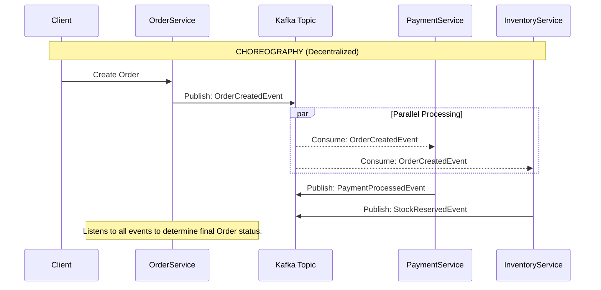

# Messaging and Event-Driven Architecture

## Overview

As systems scale from single monolithic applications to fleets of distributed microservices, the way these services communicate becomes the primary bottleneck to performance and reliability. Traditional synchronous communication (e.g., REST or gRPC) tightly couples services together in time. If Service A calls Service B, and Service B is slow or down, Service A also becomes slow or fails. This leads to cascading failures across the enterprise.

To break this temporal coupling, we use Messaging and Event-Driven Architectures (EDA). By introducing an intermediary (a message broker or event streaming platform), Service A can emit a message and immediately return a response to the user. Service B can process that message at its own pace.

For a Staff/Principal Engineer, EDA is the cornerstone of building highly available, scalable financial systems. You must understand the profound difference between a "Message Queue" and an "Event Stream", the guarantees of at-least-once vs. exactly-once delivery, and complex patterns like Event Sourcing and Command Query Responsibility Segregation (CQRS). In banking, if a payment event is lost or processed twice, the ledger is corrupted. Mastering these concepts is essential to passing system design interviews at top tech and financial firms.

## Foundational Concepts

### Synchronous vs. Asynchronous Communication

*   **Synchronous (REST/gRPC)**: The caller sends a request and blocks (waits) until the receiver processes it and sends a response.
    *   *Pros*: Simple to understand, immediate feedback (success/failure), easy to trace.
    *   *Cons*: Temporal coupling. If the downstream service is down, the upstream service fails. If the downstream service is slow, the upstream service consumes threads waiting, leading to resource exhaustion.
*   **Asynchronous (Messaging)**: The caller sends a message to an intermediary (broker) and immediately continues its work. The receiver picks up the message later.
    *   *Pros*: Decoupling, fault tolerance (the broker holds messages if the receiver is down), load leveling (the receiver pulls messages at a safe rate, preventing it from being overwhelmed).
    *   *Cons*: Complex error handling (how does the user know their payment ultimately failed?), lack of immediate consistency, operational overhead of managing the broker.

### Message Queues vs. Event Streams

This is a critical distinction that many candidates fail to articulate.

**Message Queues (RabbitMQ, ActiveMQ, AWS SQS)**
*   **Intent**: A command or a specific task that needs to be done. "Hey Email Service, send this email."
*   **Transient**: Once a consumer successfully processes and acknowledges (acks) the message, the broker deletes it.
*   **Point-to-Point (Usually)**: A message is typically consumed by exactly one consumer in a competing consumer group. If you have 5 instances of an Email Service, only one will process a given email message.
*   **Smart Broker / Dumb Consumer**: The broker tracks exactly which messages have been delivered and acknowledged by which consumers.

**Event Streams (Apache Kafka, AWS Kinesis)**
*   **Intent**: A fact about something that happened in the past. "User 123 updated their profile."
*   **Persistent (Durable)**: The broker stores the event on disk for a configured retention period (e.g., 7 days, or forever). Consumers reading the event do *not* delete it.
*   **Publish-Subscribe (Pub/Sub)**: Multiple different services can read the *same* event. The Fraud Service, the Analytics Service, and the Audit Service can all independently consume the "User Updated" event.
*   **Dumb Broker / Smart Consumer**: The broker simply appends events to a log. The consumers are responsible for tracking their own position (offset) in that log.

## Technical Deep Dive

### Delivery Semantics

When transferring a message over a network that can fail, what guarantees do you have?
1.  **At-Most-Once (Fire and Forget)**: The producer sends the message once. If the network drops it, it's lost. Acceptable for high-volume, low-value telemetry (e.g., a single sensor ping).
2.  **At-Least-Once**: The producer sends the message and waits for an acknowledgment. If it times out, it resends the message. This guarantees delivery, but means the consumer might receive the same message twice. **This is the industry standard.**
3.  **Exactly-Once**: The Holy Grail. Mathematical perfection where a message is delivered and processed exactly one time. In reality, this requires complex coordination between the producer, the broker, and the consumer (e.g., Kafka's transactional API), incurring significant performance overhead.

**The Golden Rule**: Because At-Least-Once is the standard, all consumers *must* be Idempotent. If a consumer receives the same "Charge $100" message twice, it must mathematically guarantee it only charges the database once.

### Backpressure and Dead Letter Queues (DLQ)

*   **Load Leveling / Backpressure**: If an upstream service produces 10,000 messages/sec, but the downstream service can only process 1,000/sec, synchronous REST would crash the downstream service (or result in timeouts). A message queue absorbs the spike. The downstream service "pulls" messages at its maximum safe rate, preventing self-destruction.
*   **Dead Letter Queue (DLQ)**: What happens if a message is malformed (e.g., missing a required JSON field)? The consumer tries to process it, throws an exception, and the message goes back on the queue. The consumer tries again... forever (a "Poison Pill"). 
    *   *Solution*: Configure the queue to move a message to a DLQ after `N` failed attempts. Engineers can then alert on the DLQ, inspect the bad message, fix the code, and optionally replay it.

### Event-Driven Architecture Patterns

#### 1. Event Sourcing
Instead of storing the *current state* of an entity in a database (e.g., `balance = $500`), you store the *complete history of events* that led to that state (e.g., `AccountOpened`, `Deposited $1000`, `Withdrew $500`).
*   **Pros**: 100% accurate audit trail (crucial in banking). You can reconstruct the state of the system at any point in time ("time travel"). Avoids complex database update locking.
*   **Cons**: Extremely complex. How do you query "All users with balance > $100"? You can't query an event store easily. This forces you to use CQRS (below).
*   **Snapshotting**: Because replaying 10 years of transactions to find a balance is slow, systems take occasional "snapshots" (e.g., calculating the balance at midnight on Dec 31st) and only replay events that occurred after the snapshot.

#### 2. CQRS (Command Query Responsibility Segregation)
Splitting the system into two distinct halves: a Write Model (Commands) and a Read Model (Queries).
*   **The Problem**: A highly normalized, 3rd Normal Form database is great for ensuring data integrity during writes, but terrible for joining 12 tables to render a complex UI dashboard.
*   **The Solution**: The Command side validates business logic and writes to the primary database (or Event Store). It then publishes an event. The Query side listens to that event and updates a heavily denormalized, read-optimized database (e.g., a MongoDB document or an Elasticsearch index).
*   **The Trade-off**: Eventual Consistency. After a user submits a command, there is a small delay (milliseconds to seconds) before the event propogates and updates the Read database. The UI must be designed to handle this (e.g., "Your changes are being saved" instead of immediately reloading the data).

## Visual Representations

### Event Sourcing and CQRS Architecture

```mermaid
%%{init: {'theme': 'base', 'themeVariables': { 'primaryColor': '#E3F2FD', 'edgeLabelBackground':'#FFF'}}}%%
flowchart TD
    classDef client fill:#E1BEE7,stroke:#8E24AA,stroke-width:2px;
    classDef command fill:#FFCCBC,stroke:#E64A19,stroke-width:2px;
    classDef query fill:#C8E6C9,stroke:#388E3C,stroke-width:2px;
    classDef data fill:#FFF9C4,stroke:#FBC02D,stroke-width:2px;
    classDef kafka fill:#B3E5FC,stroke:#0288D1,stroke-width:2px;

    Client((Web / Mobile)):::client

    subgraph Command Side (Write Model)
        CommandAPI[Command API \n POST /accounts/123/withdraw]:::command
        EventStore[(Event Store \n Append-Only DB)]:::data
    end

    subgraph Event Bus
        Broker[Kafka / Event Bus]:::kafka
    end

    subgraph Query Side (Read Model)
        Projector[Event Projector \n (Consumer)]:::query
        ReadDB[(Read DB \n MongoDB / Elasticsearch)]:::data
        QueryAPI[Query API \n GET /accounts/123/balance]:::query
    end

    Client -->|1. Submit Command| CommandAPI
    CommandAPI -->|2. Append Event: \n FundsWithdrawn| EventStore
    EventStore -.->|3. Publish Event| Broker
    
    Broker -.->|4. Consume Event| Projector
    Projector -->|5. Update Denormalized View| ReadDB
    
    Client -->|6. Query Dashboard| QueryAPI
    QueryAPI -->|7. Fast Read Without Joins| ReadDB
    
    %% Note on consistency
    CommandAPI -.->|Returns 202 Accepted \n (Immediate)| Client
```

### Choreography vs. Orchestration (Handling Distributed Transactions)



## Code/Configuration Examples

### Idempotent Consumer (Spring Boot / RabbitMQ)

In an At-Least-Once delivery system, your consumer might receive the same message twice due to network timeouts. You must protect the database.

```java
@Service
public class PaymentConsumer {

    private final PaymentRepository repository;
    private final ExternalPaymentGateway gateway;

    @RabbitListener(queues = "payment.commands.queue")
    @Transactional // Wrap in a DB transaction
    public void processPaymentCommand(PaymentCommand command) {
        
        // 1. IS THIS A DUPLICATE? Check the Idempotency Key
        if (repository.existsByIdempotencyKey(command.getMessageId())) {
            // We've already processed this. Acknowledge the message (consume it) 
            // but do nothing else safely.
            log.warn("Duplicate message received: {}", command.getMessageId());
            return; 
        }

        try {
            // 2. Process Business Logic
            PaymentResult result = gateway.charge(command.getAmount(), command.getToken());
            
            // 3. Save to DB. Crucially, we save the messageId to prevent future duplicates.
            PaymentRecord record = new PaymentRecord();
            record.setIdempotencyKey(command.getMessageId());
            record.setStatus(result.isSuccess() ? "COMPLETED" : "FAILED");
            repository.save(record);
            
        } catch (GatewayTimeoutException e) {
            // 4. If the external gateway fails, we THROW an exception.
            // Spring AMQP will automatically NACK (reject) the message,
            // putting it back on the queue to be retried (or moved to a DLQ).
            throw new RuntimeException("Gateway timeout, retry message later");
        }
    }
}
```

## Interview Questions & Model Answers

**Q1: Contrast RabbitMQ with Apache Kafka. When would you choose one over the the other?**
*Answer*: RabbitMQ is a traditional message broker designed for smart routing and point-to-point task queues. It tracks the state of every message; once a consumer acknowledges a message, RabbitMQ deletes it. I would use it for targeted commands (e.g., "Send an email", "Generate a PDF") where I want complex routing rules and dead-letter queueing.
Kafka is a distributed event streaming platform built on a distributed append-only log. It simply stores events on disk for a set period. It is dumb; consumers must track their own read position (offset). Because events aren't deleted upon consumption, multiple different microservices can replay the same history of events at their own pace. I would use Kafka for pub/sub architectures, massive data pipelines, or Event Sourcing systems where the history of facts is valuable to multiple independent domains.

**Q2: We are building an e-commerce checkout flow. We need to create an order, reserve inventory, and charge the credit card. We cannot use a distributed database transaction (2PC). How do we ensure consistency if the credit card fails after the inventory is reserved?**
*Answer*: We must use the Saga Pattern. Specifically, I would use an Orchestrated Saga. An Order Orchestrator service receives the checkout request. It sends a message to the Inventory Service to reserve stock. If successful, it sends a message to the Payment Service. If the Payment Service returns a failure event (e.g., insufficient funds), the Orchestrator executes a Compensating Transaction: it sends a message back to the Inventory Service commanding it to "Release Stock". This handles the distributed workflow and ensures eventual consistency without locking the databases simultaneously. 

**Q3: Describe the Transactional Outbox Pattern and why it's necessary in microservices.**
*Answer*: In microservices, it is an anti-pattern to perform a "Dual-Write": updating a local database and then immediately publishing an event to a message broker (e.g., `db.save(user); kafka.send(userCreatedEvent);`). If the database commits but the network call to Kafka fails (or vice versa), the system is permanently inconsistent.
The Transactional Outbox pattern solves this. Instead of calling Kafka directly, the application inserts the business data into its main table *and* inserts the event payload into a local `Outbox` table within the same, atomic, local ACID transaction. A separate, highly reliable background process (like Debezium doing Change Data Capture) tails the Outbox table and guarantees delivery of those events to Kafka.

**Q4: In an Event Sourced system, if I need to calculate a user's balance, do I have to replay 10 years of their transaction history every time they open their mobile app?**
*Answer*: No, that would cause severe latency and computational overhead. There are two solutions. First, we use **Snapshotting**. A background process periodically calculates the state (e.g., every 100 events, or every midnight) and saves a `BalanceSnapshot` object. To find the current balance, the system loads the most recent snapshot and only replays the few events that occurred after it.
However, the enterprise standard is to pair Event Sourcing with **CQRS**. The stream of events is consumed by a Projector, which continuously calculates the absolute latest balance and saves it into an optimized Read Database (like Redis or a materialized view in Postgres). The mobile app simply does a fast `GET` from the Read Database, completely bypassing the Event Store.

## Real-World Enterprise Scenarios

**Scenario: Bank Account Core Ledger**
*   **Context**: Traditional relational ledgers update a row indicating `balance: 500`. If someone challenges a transaction from two years ago, tracing the exact sequence of updates that led to that 500 can be difficult and requires heavy audit tables.
*   **Architecture Choice**: Event Sourcing. The Core Ledger is rebuilt. Instead of `UPDATE accounts SET balance = balance - 100`, the system generates an immutable `FundsDebited(accountId: 123, amount: 100, reason: "ATM Transfer")` event. 
*   **Benefits**: The event is the absolute source of truth. Auditability is mathematically guaranteed. To see the balance as it was exactly on March 15th at 2:00 PM, you simply replay the events up to that timestamp.
*   **Trade-off**: The complexity of the read side (CQRS) and the difficulty of evolving the schema of old events (Event Versioning). If an event schema changes in V2 of the application, the application must still be able to deserialize V1 events stored years ago.

## Common Pitfalls & Best Practices

**Pitfalls:**
*   **The Distributed Monolith**: Using synchronous REST calls between 20 microservices. If Service A calls B calls C calls D, and D goes down, the entire chain fails. The system is less reliable than a single monolith. You must break chains with asynchronous messaging.
*   **Assuming Message Ordering**: In high-throughput queues, assuming Message 2 will be processed after Message 1 is dangerous. If Message 1 fails and is retried, Message 2 will be processed first. Your consumers must be designed to handle out-of-order events (e.g., ignoring an `AddressUpdated` event if an `AccountClosed` event has already been processed).

**Best Practices:**
*   **Idempotency Everywhere**: Design every single message consumer to safely handle receiving the exact same message two, three, or ten times. Use unique message IDs and database constraints.
*   **Correlation IDs**: When Service A sends a message that triggers Service B, C, and D, inject a `X-Correlation-ID` header into the initial message and ensure all downstream services log it. Without this, distributed tracing and debugging in Splunk/ELK is impossible.

## Comparison Tables

| Feature | RabbitMQ (Message Broker) | Apache Kafka (Event Streaming) |
| :--- | :--- | :--- |
| **Primary Use Case** | Task routing, Work queues, RPC | Event sourcing, Stream processing, Logs |
| **Message Lifetime** | Deleted upon acknowledgment | Retained on disk (days, months, forever) |
| **Routing Flexibility**| High (Exchanges, Topic routing keys) | Low (Consumers read partitions linearly) |
| **Performance** | ~50k msgs/sec | >1 Million msgs/sec |
| **Consumer State** | Broker tracks what is consumed | Consumer tracks its own offset in the log |

| Architecture | Description | Pros | Cons |
| :--- | :--- | :--- | :--- |
| **CRUD** | Overwrite current state in DB | Simple, immediately consistent | Data loss on updates, poor auditability |
| **Event Sourcing** | Store sequence of immutable events | Perfect auditability, time-travel, loose coupling | Complex, requires CQRS for querying |

## Key Takeaways

*   **Decouple with Messaging**: Asynchronous communication is the primary mechanism to isolate failures and scale microservices independently.
*   **Queues are commands; Streams are facts**: Use RabbitMQ to tell a service *what to do*. Use Kafka to tell the enterprise *what has happened*.
*   **Idempotency over Exactly-Once**: Aiming for exactly-once delivery is computationally expensive. Use at-least-once delivery combined with idempotent consumer logic.
*   **CQRS separates reads from writes**: When domains become complex, optimize one database for writing (Event Store/RDBMS) and a completely separate database for reading (NoSQL/Cache), joined asynchronously by events.

## Further Reading
*   *Enterprise Integration Patterns by Gregor Hohpe* (The absolute bible of messaging architectures).
*   [Martin Fowler on Event Sourcing](https://martinfowler.com/eaaDev/EventSourcing.html)
*   [Microservices.io - The Saga Pattern](https://microservices.io/patterns/data/saga.html)
*   [Confluent: What is Apache Kafka?](https://www.confluent.io/what-is-apache-kafka/)
