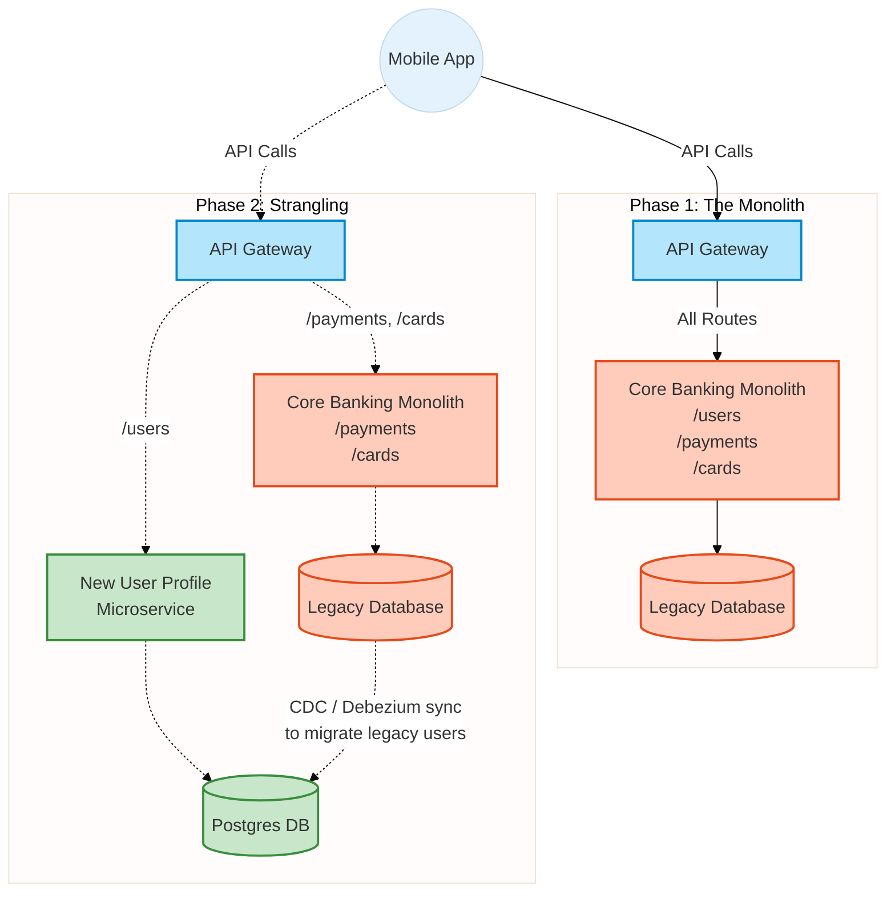

# Microservices Architecture and Domain-Driven Design

## Overview

The shift from monolithic architectures to microservices is one of the most significant transformations in software engineering over the last decade. In enterprise banking, massive 20-year-old Java EE mainframes are being decomposed into fleets of independent, cloud-native services.

For a Staff/Principal Engineer, the interview focus is never "How do I build a microservice using Spring Boot?" That is a junior-level concern. The true tests are: **Where do you draw the boundaries between services?** How do you manage data that needs to be shared across those boundaries without creating a distributed monolith? How do you migrate a legacy system without breaking the business?

Microservices solve organizational scaling problems (allowing 50 small teams to deploy independently) but they introduce immense technical complexity. You are trading in-memory method calls for unpredictable network hops. You are trading a single ACID database transaction for distributed sagas. Interviewers want to see that you understand this trade-off and have the architectural maturity (through Domain-Driven Design) to minimize the pain.

## Foundational Concepts

### Monolith vs. Microservices vs. Modular Monolith

*   **Monolith**: A single deployable unit (e.g., a massive `.war` file). All code runs in the same process and usually connects to a single database schema. 
    *   *Pros*: Simple to develop, simple to test, simple to deploy, excellent performance (in-memory calls).
    *   *Cons*: Tangled code dependencies, entire system must be deployed to change one line of code, technology lock-in, hard to scale specific components independently.
*   **Microservices**: An architectural style that structures an application as a collection of loosely coupled, independently deployable services organized around business capabilities. Each service owns its own data.
    *   *Pros*: Independent deployment, technology diversity, granular scalability, isolated failures.
    *   *Cons*: Distributed system complexity (network failures, distributed tracing), eventual consistency, operational overhead.
*   **Modular Monolith**: The rising star. A single deployable unit, but internally structured with strict, enforced boundaries (like independent modules) that communicate via explicit interfaces, not shared database tables. It offers the simplicity of a monolith with the clean boundaries of microservices, acting as a perfect stepping stone.

### Domain-Driven Design (DDD)

DDD is a methodology conceived by Eric Evans for modeling complex software. It is the gold standard for defining microservice boundaries.
*   **Domain & Subdomains**: The overall business area (e.g., "Banking"). This is broken down into Core Subdomains (what makes the business money, e.g., "Trading Algorithm"), Supporting Subdomains (e.g., "Customer Support CRM"), and Generic Subdomains (e.g., "Identity/Auth - just use Keycloak or Auth0").
*   **Bounded Context**: The most critical concept. A linguistic and architectural boundary. Inside a bounded context, a term means exactly one thing.
    *   *Example*: The term "Account". In the `Core Ledger` context, an "Account" is a mathematical entity with a numeric balance. In the `Customer Profile` context, an "Account" is a login credential and an email address. If you try to build one giant `Account` class (the monolith way), it becomes bloated. DDD dictates you build two separate microservices, each with its own tailored, smaller `Account` model.

## Technical Deep Dive

### Service Decomposition Strategies

How do you break down a massive banking monolith into microservices?

1.  **Decompose by Business Capability**: Aligning services with organizational structure (e.g., Retail Banking, Wealth Management, Mortgages). This creates large, coarse-grained services.
2.  **Decompose by Subdomain (DDD)**: The preferred approach. Identifying the Bounded Contexts and making each a microservice (e.g., `Payment Execution Service`, `Fraud Detection Service`, `User Notification Service`).
3.  **The Strangler Fig Pattern**: The only safe way to migrate a legacy monolith.
    1.  Deploy an API Gateway (or reverse proxy) in front of the monolith.
    2.  Build a *new* microservice (e.g., `Notification Service`).
    3.  Route requests for `/api/notifications` from the gateway to the new microservice, bypassing the monolith.
    4.  Over months/years, strangle the monolith function by function until it can be deleted.

### Data Management: The Database-per-Service Pattern

This is the hardest rule of microservices. **Services must not share database tables.**

*   **The Shared Database Anti-Pattern**: If the `Order` service and the `Inventory` service both `SELECT` and `UPDATE` the same `inventory_items` table, they are tightly coupled. If the `Inventory` team alters the table schema, they break the `Order` service. The entire point of independent deployability is ruined.
*   **Database-per-Service**: The `Order` service has its own database. The `Inventory` service has its own database. If the `Order` service needs to know inventory levels, it **must** ask the `Inventory` service via a network API call (or, preferably, consume an event published by the Inventory service).
*   **The Consequences**: 
    1.  You can no longer use ACID transactions spanning both services (solved by the **Saga Pattern**).
    2.  You can no longer write a simple SQL `JOIN` to query an Order and its Inventory details (solved by **API Composition** or **CQRS**).

### Inter-Service Communication Patterns

1.  **Synchronous (HTTP/REST/gRPC)**: The client waits for the response. Simple, but creates temporal coupling. Used for queries (e.g., `GET /user/profile`) or operations where immediate, guaranteed synchronous feedback is required (e.g., Auth token validation).
2.  **Asynchronous Messaging (Kafka/RabbitMQ)**: Fire and forget. Fosters loose coupling. Used for commands and state changes (e.g., `Publish: OrderCreatedEvent`).

## Visual Representations

### The Strangler Fig Migration Pattern



### Bounded Contexts (Domain-Driven Design)

```mermaid
%%{init: {'theme': 'base', 'themeVariables': { 'primaryColor': '#E3F2FD', 'edgeLabelBackground':'#FFF'}}}%%
graph TD
    classDef ctx fill:#E1BEE7,stroke:#8E24AA,stroke-width:2px;
    classDef entity fill:#FFF9C4,stroke:#FBC02D,stroke-width:2px;

    subgraph Context 1: Identity & Access Management
        CTX1[IAM Service]:::ctx
        User1[Entity: User \n (credentials, roles, mfa_status)]:::entity
        CTX1 --- User1
    end

    subgraph Context 2: Retail Core Banking
        CTX2[Account Ledger Service]:::ctx
        User2[Entity: Account Holder \n (kyc_status, total_balance)]:::entity
        CTX2 --- User2
        
        %% Notice the different language/structure for the "same" person
    end

    subgraph Context 3: Marketing & CRM
        CTX3[Campaign Service]:::ctx
        User3[Entity: Lead / Target \n (email_opt_in, risk_appetite)]:::entity
        CTX3 --- User3
    end

    %% Communication via events, not shared database tables
    CTX1 -.->|Event: UserCreated| Kafka[Event Bus]
    Kafka -.->|Consumed By| CTX2
    Kafka -.->|Consumed By| CTX3
```

## Code/Configuration Examples

### API Composition (Java/Spring WebFlux)

When you break a database into many microservices, you lose SQL JOINs. If the frontend needs a "Dashboard" showing User Details (Service A) and Recent Transactions (Service B), you must write an API Composer (or BFF) to fetch both concurrently and merge them.

```java
@RestController
@RequestMapping("/dashboard")
public class DashboardBFFController {

    private final WebClient userServiceClient;
    private final WebClient transactionServiceClient;

    // Use Reactive programming (WebFlux/Reactor) to execute network calls concurrently.
    // Making sequential calls (Wait for Service A, then call Service B) destroys latency.
    @GetMapping("/{userId}")
    public Mono<DashboardResponse> getAggregatedDashboard(@PathVariable String userId) {
        
        Mono<UserProfile> userProfileMono = userServiceClient.get()
                .uri("/users/{id}", userId)
                .retrieve()
                .bodyToMono(UserProfile.class)
                // If the user service fails, return a partial dashboard rather than bringing the whole page down
                .onErrorReturn(new UserProfile("Unknown", "Service Unavailable")); 

        Mono<List<Transaction>> transactionsMono = transactionServiceClient.get()
                .uri("/transactions?userId={id}", userId)
                .retrieve()
                .bodyToFlux(Transaction.class)
                .collectList()
                .onErrorReturn(Collections.emptyList());

        // Zip the two concurrent asynchronous calls together once both are complete
        return Mono.zip(userProfileMono, transactionsMono, 
            (profile, txns) -> new DashboardResponse(profile, txns));
    }
}
```

## Interview Questions & Model Answers

**Q1: We have 50 microservices. The UI needs to display an Order history page that includes data from the User, Order, Payment, and Shipping services. How do you implement this efficiently?**
*Answer*: We have removed the ability to do a large 4-table SQL JOIN by adopting the Database-per-Service pattern.
Approach 1: **API Composition**. I would build a Backend-For-Frontend (BFF) service. When the UI requests the Order History page, the BFF makes concurrent, asynchronous GET requests (using Reactive Java or Go routines) to the four underlying microservices, merges the JSON payloads in memory, and returns a single response to the UI. This works well for simple aggregations but falls apart if we need to sort or heavily filter across the merged dataset.
Approach 2: **CQRS (Command-Query Responsibility Segregation)**. If complex sorting/filtering is required (e.g., "Show me shipped orders where payment > $500"), I would use CQRS. A dedicated `OrderHistoryView` service listens to events from all four services via Kafka (`UserUpdated`, `OrderCreated`, `PaymentSuccess`, `ItemShipped`). It consumes these events and continuously updates a highly denormalized, read-optimized database (like Elasticsearch or MongoDB). The UI makes a single, blazing-fast `GET` request to this `OrderHistoryView` service. The trade-off is eventually consistent data and the complexity of managing the event processors.

**Q2: What is the "Database-per-Service" pattern, and why is it considered the absolute strictest rule of Microservices architecture?**
*Answer*: The pattern states that a microservice's persistent data must be entirely private to that service and accessible only via its API. If Service B needs data owned by Service A, it must ask Service A's API or consume its events; it cannot connect directly to Service A's database table.
If we violate this (the "Shared Database Integration" anti-pattern), we create tight coupling. The schema of the shared table becomes a rigid, unchangeable public API. Team A cannot alter their database columns, optimize their indexes, or switch from PostgreSQL to Cassandra without coordinating downtime and code changes with Team B, Team C, and Team D. It destroys the primary benefit of microservices: independent deployability and rapid feature velocity.

**Q3: Explain the Bounded Context concept in Domain-Driven Design using a banking example.**
*Answer*: A Bounded Context is a linguistic and architectural boundary within a system. Inside that boundary, a specific domain model applies.
For example, consider the concept of a "Transaction." 
In the `Payment Execution` bounded context, a "Transaction" is a complex, stateful entity representing the movement of money. It has fields for `ISO-8583 message payloads`, `network_authorization_codes`, and `settlement_status`.
In the `Fraud Analysis` bounded context, a "Transaction" is just a data point in a machine learning model. It doesn't need to know about settlement status; it needs to know the `IP_address`, `device_fingerprint`, and `geo_location`.
Instead of forcing everyone to use a massive 150-field `Transaction` class connected to a monolithic database table, DDD dictates that we create two separate microservices. They each have their own customized, lightweight representation of a Transaction, reducing code bloat and preventing teams from stepping on each other's toes.

**Q4: How do you safely migrate a massive, 15-year-old monolithic Java banking application to Microservices?**
*Answer*: You absolutely cannot do a "Big Bang" rewrite. The business risk is catastrophic. Instead, you use the **Strangler Fig Pattern**.
First, I would put a transparent API Gateway in front of the monolith to control routing. Next, we select a low-risk, loosely coupled "edge" domain—say, `Customer Notifications`. We build this as a new microservice with its own database. We update the API Gateway to route `/api/notifications` traffic to the new service instead of the monolith. Alternatively, if the monolith needs to trigger a notification, we refactor that specific monolith code to emit a `SendNotificationCommand` message to a queue, which the new service processes. Over years, we systematically extract (strangle) bounded contexts (`User Profile`, `Reporting`, `Payments`) out of the monolith piecemeal. When nothing routes to the monolith anymore, we decommission it safely.

## Real-World Enterprise Scenarios

**Scenario: The "Distributed Monolith" Anti-Pattern**
*   **Context**: A bank broke its monolith into 30 microservices. However, latency has skyrocketed, and every time the `Account` service is deployed, the `Loan` and `CreditCard` services crash. 
*   **The Diagnosis**: The team broke the code apart, but they didn't break the domains apart correctly. The `Loan` service makes synchronous REST calls to the `Account` service 15 times during a single user request to fetch bits of data. 
*   **The Cure**: The Bounded Context boundaries are wrong. We are suffering from high temporal coupling. 
    1.  We must refactor the communication from synchronous REST to asynchronous events (Kafka) wherever possible.
    2.  We might need to duplicate some read-only data (Caching / Data Replication). If the `Loan` service constantly needs the user's `risk_score`, the `Account` service should publish a `RiskScoreUpdated` event. The `Loan` service saves a local read-only copy of that score in its own database to prevent synchronous network hops.

## Common Pitfalls & Best Practices

**Pitfalls:**
*   **Nano-services**: Making services too small (e.g., a service for `Authentication`, a separate service for `Authorization`, a separate service for `SessionManagement`). The network overhead of these services communicating with each other outweighs the benefits. Combine highly cohesive things into a single bounded context.
*   **Ignoring Network Failure**: Assuming that `RestTemplate.getForObject(...)` will always succeed in less than 50ms. Networks drop packets, DNS fails, and pods restart. You must wrap inter-service calls in circuit breakers and implement strict timeouts.
*   **Shared Libraries for Core Logic**: Putting the core banking logic inside a `.jar` file and having 10 microservices import it. If you need to change the logic, you must coordinate the deployment of all 10 microservices simultaneously. You haven't built microservices; you've built a distributed monolith. Shared libraries should be restricted to cross-cutting concerns (e.g., logging formats, auth token parsers, HTTP clients).

**Best Practices:**
*   **Smart Endpoints and Dumb Pipes**: Don't put business routing logic inside an Enterprise Service Bus (ESB) or API Gateway. The middleware should just transport messages (Kafka, RabbitMQ, generic API Gateway). The microservices themselves contain the business routing and logic.
*   **Consumer-Driven Contract Testing (Pact)**: If Service A maintains an API consumed by Service B, how do you ensure Service A doesn't deploy a breaking change? Service B writes a "Contract" (the exact JSON it expects). Service A must pass that test in its CI/CD pipeline before it is allowed to deploy to production.

## Comparison Tables

| Architecture | Deployment | Data Ownership | Scaling Granularity | Fault Tolerance |
| :--- | :--- | :--- | :--- | :--- |
| **Monolith** | Single binary | Shared schema | Must scale entire app | Poor (one bug crashes all) |
| **Modular Monolith**| Single binary | Schema separation| Must scale entire app | Poor (shared heap/DB connections) |
| **Microservices** | Independent | Strict private DB per service| Highly granular | Excellent (bulkheaded) |

| Inter-Service Communication | Protocol | Temporal Coupling | Use Case |
| :--- | :--- | :--- | :--- |
| **Synchronous** | REST, gRPC | High (Sender waits for receiver) | Complex queries, immediate fail-fast needs |
| **Asynchronous Command**| AMQP (RabbitMQ) | Low (Queued) | Long-running tasks (e.g., Generate Statement) |
| **Asynchronous Event** | Kafka | Zero (Pub/Sub) | Updating read models (CQRS), state changes |

## Key Takeaways

*   **Boundaries define the system**: Get Domain-Driven Design (DDD) right. If you draw the bounded contexts incorrectly, you will build a highly coupled, slow, distributed monolith.
*   **Share Nothing**: A microservice owns its domain and its database. Do not attempt "integration via a shared database table." Use APIs or events.
*   **Expect the Network to Fail**: Moving from in-memory function calls to network RPCs introduces latency and unpredictable drops. You cannot build microservices without immediate fallback strategies and circuit breakers.
*   **Strangle the Monolith**: Avoid big-bang rewrites. Use the Strangler Fig pattern to systematically migrate functionality behind an API Gateway while reducing business risk.

## Further Reading
*   *Building Microservices (2nd Edition) by Sam Newman* (The essential text on the topic).
*   *Domain-Driven Design (The Blue Book) by Eric Evans*.
*   [Microservices.io Archive (Chris Richardson)](https://microservices.io/) - Extensive catalog of microservice design patterns.
*   [Martin Fowler: The Strangler Fig Application](https://martinfowler.com/bliki/StranglerFigApplication.html)
