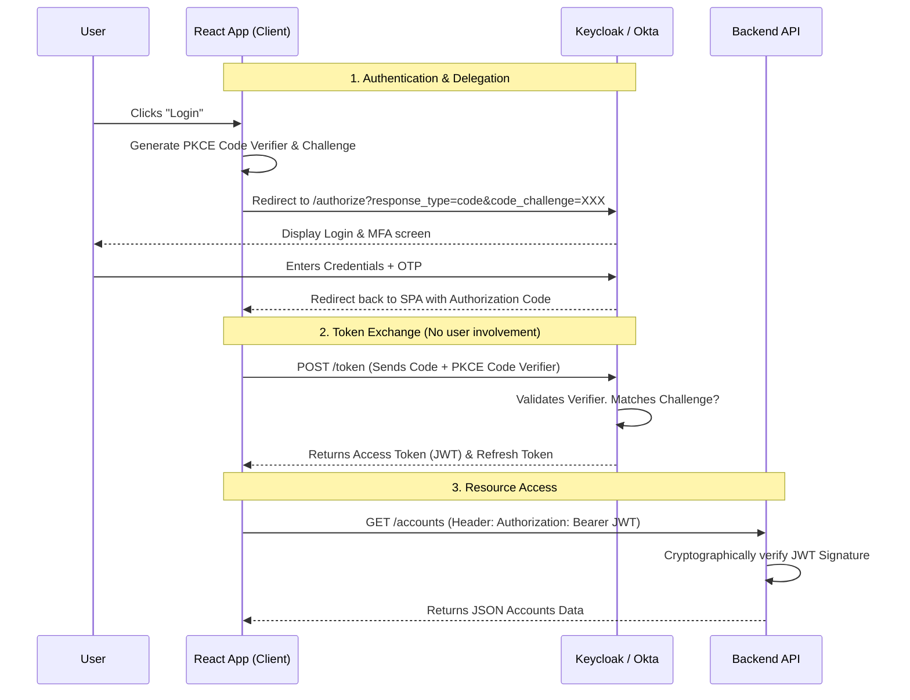

# Security Architecture and Identity

## Overview

In enterprise banking and financial services, security cannot be an afterthought bolted onto the end of a project. It must be woven into the fabric of the architecture—a concept known as "Security by Design" and "Zero Trust." A single data breach can result in billions of dollars in regulatory fines and irreparable reputational damage.

For a Staff/Principal Engineer, the expectation is that you are intimately familiar with how modern identity flows work (OAuth 2.0 and OpenID Connect), how data is protected both at rest and in transit (mTLS, envelope encryption), and how to secure a perimeter against DDoS and OWASP Top 10 attacks. Interviewers will push past the basics ("use HTTPS"); they want to know *where* you terminate HTTPS, *how* you rotate keys, and *how* microservices authenticate with each other.

If you propose an architecture where the UI sends an unhashed password to the backend, or where internal microservices freely trust any request coming from inside the network (the broken "Castle and Moat" model), you will fail the interview.

## Foundational Concepts

### 1. Zero Trust Architecture
The traditional "Castle and Moat" model assumed everything inside the corporate VPN or Kubernetes cluster was safe. Zero Trust assumes the network is already compromised.
*   **Principle**: "Never Trust, Always Verify." Every single network call—even from an internal microservice to a highly secured internal database—must be authenticated, authorized, and encrypted.

### 2. Authentication (AuthN) vs. Authorization (AuthZ)
*   **Authentication (Who are you?)**: Proving the identity of a human or a machine (e.g., verifying a password + SMS OTP, or validating a client certificate).
*   **Authorization (What can you do?)**: Verifying if the authenticated identity has permission to perform the requested action (e.g., "Yes, you are Alice, but no, you cannot view Bob's account balance").

### 3. Encryption: At Rest and In Transit
*   **In Transit**: Protecting data as it moves across networks. Achieved using TLS (Transport Layer Security).
*   **At Rest**: Protecting data written to disk (databases, S3 buckets, Kafka logs). If a hacker steals the physical hard drive from an AWS datacenter, the data must be unintelligible. Achieved using AES-256 encryption.

## Technical Deep Dive

### Modern Identity: OAuth 2.0 and OpenID Connect (OIDC)

*   **OAuth 2.0 is for Authorization**: It allows a user (Resource Owner) to grant a third-party application (Client) limited access to their resources (Resource Server) without giving the application their password. 
    *   *Example*: You give Mint.com permission to read your Chase bank balance.
*   **OpenID Connect (OIDC) is for Authentication**: Built on top of OAuth 2.0. It provides a standard way to verify the user's identity and obtain basic profile data (via the `id_token`, a JWT).
    *   *Example*: "Log in with Google" or "Log in with Apple."

#### The Authorization Code Flow (The Secure Standard)
Never use the Implicit Flow (which returns tokens directly in the URL). For Single Page Applications (React) and Mobile apps, use the Authorization Code Flow with PKCE (Proof Key for Code Exchange) to prevent authorization code interception attacks.

### Securing Microservice Communication (mTLS)

Standard TLS (HTTPS) only authenticates the server. The client verifies the server's cert against a root CA (e.g., "Yes, this is definitely google.com").
*   **Mutual TLS (mTLS)**: Both sides verify each other. The client verifies the server, *and* the server verifies the client's certificate. 
*   **Why use it?**: If the `Payment Service` only accepts mTLS connections from the `Checkout Service`, then if a hacker compromises the `Avatar Service`, they cannot invoke the `Payment Service` because the `Avatar Service` lacks the correct client certificate.
*   **Implementation**: Manually managing and rotating thousands of certificates across microservices is impossible. This is the primary reason teams adopt a **Service Mesh** (like Istio), which automates mTLS certificate issuance and rotation transparently using its Control Plane (Citadel).

### Token Management: JWT vs. Opaque Tokens

*   **JSON Web Tokens (JWT)**: Stateless. The token itself contains the user's identity, roles, and an expiration time, digitally signed by the Auth Server (using a private RSA key).
    *   *Pros*: Microservices can verify the token (using the public RSA key) without making a network call to the Auth server. Extremely fast.
    *   *Cons*: You cannot easily revoke a JWT before it expires. If a user's laptop is stolen, the JWT remains legally valid until the `exp` timestamp hits.
*   **Opaque Tokens / Reference Tokens**: A random string (like a UUID) that means nothing to the microservice. 
    *   *Pros*: Instantly revocable. The session state is maintained securely on the Auth Server.
    *   *Cons*: The API Gateway or Microservice must make a network call to the Auth Server (Introspection Endpoint) to validate the token on *every single request*, creating a massive bottleneck.

**The Enterprise Compromise**: The UI holds an Opaque token (or a short-lived JWT + Refresh Token). When the request hits the API Gateway, the Gateway validates it. If valid, the Gateway generates a fresh, short-lived (e.g., 5 minute) JWT and passes that JWT into the internal microservice network.

## Visual Representations

### OAuth2 Authorization Code Flow with PKCE (Banking UI)



### Encryption Architecture: Envelope Encryption

Key Management Services (AWS KMS, HashiCorp Vault) use Envelope Encryption to protect data without sending gigabytes of data over the network to be encrypted.

```mermaid
flowchart TD
    classDef kms fill:#E1BEE7,stroke:#8E24AA,stroke-width:2px;
    classDef app fill:#C8E6C9,stroke:#388E3C,stroke-width:2px;
    classDef db fill:#FFF9C4,stroke:#FBC02D,stroke-width:2px;

    App[Banking Microservice]:::app
    KMS[AWS KMS \n Holds Customer Master Key (CMK)]:::kms
    DB[(PostgreSQL / S3)]:::db

    App -->|1. Request Data Key| KMS
    KMS -->|2. Returns Plaintext Data Key \n + Encrypted Data Key| App
    
    App -->|3. Encrypts JSON locally \n using Plaintext Key| App
    App -->|4. Delete Plaintext Key \n from RAM| App
    
    App -->|5. Save Encrypted JSON \n + Encrypted Data Key| DB
    
    %% Decryption Flow
    note right of DB: To Decrypt:<br/>1. Fetch Row from DB<br/>2. Send Encrypted Data Key to KMS<br/>3. KMS returns Plaintext Data Key<br/>4. App decrypts JSON locally
```

## Code/Configuration Examples

### API Gateway Security (Spring Cloud Gateway)

The Gateway acts as the zero-trust enforcer. It strips malicious headers, terminates SSL, and validates JWTs before any internal service is touched.

```yaml
spring:
  cloud:
    gateway:
      routes:
        - id: payment-service-route
          uri: https://payment-service.internal:8443
          predicates:
            - Path=/api/v1/payments/**
          filters:
            # 1. Enforce TokenRelay (Extract JWT from user and pass to backend)
            - TokenRelay=
            # 2. Add strict security headers to the HTTP response
            - SecureHeaders
            # 3. Rate Limiting via Redis. Prevent brute-forcing the payment endpoint.
            - name: RequestRateLimiter
              args:
                redis-rate-limiter.replenishRate: 10
                redis-rate-limiter.burstCapacity: 20
                key-resolver: "#{@userPrincipalKeyResolver}" # Limit per authenticated User ID, not IP

# Resource Server Configuration (JWT Validation)
  security:
    oauth2:
      resourceserver:
        jwt:
          # The Gateway will fetch the Public RSA Keys from Okta/Keycloak on startup
          # It cryptographically verifies the token signature without making a network
          # call to Okta on every request (High Performance).
          jwk-set-uri: https://auth.bank.com/oauth2/v1/keys
          issuer-uri: https://auth.bank.com
```

## Interview Questions & Model Answers

**Q1: How do you secure data at rest in a high-compliance banking environment? If a database administrator runs `SELECT * FROM users`, should they see PII (Personally Identifiable Information)?**
*Answer*: Absolutely not. While generic "Transparent Data Encryption" (TDE) encrypts the physical disk files, the database engine decrypts it automatically when a valid SQL query is run, meaning a rogue DBA can read everything.
To protect PII (SSNs, Card Numbers), we must implement **Application-Level Encryption (or Column-Level Encryption)** using **Envelope Encryption**. The Java application fetches a Data Encryption Key (DEK) from a secure vault (like AWS KMS or HashiCorp Vault), encrypts the SSN in memory, forgets the DEK, and writes ciphertext to the database. The DBA querying the database sees only garbage bytes. The data can only be decrypted by the application runtime that holds the correct IAM permissions to ask KMS to unwrap the DEK.

**Q2: We are building a mobile banking app. The app logs the user in and receives a JWT. Is it safe to store this JWT in the device's LocalStorage?**
*Answer*: No. LocalStorage and SessionStorage are vulnerable to Cross-Site Scripting (XSS) attacks. If any third-party JavaScript library on the app/web page is compromised, it can read LocalStorage and steal the JWT, resulting in complete account takeover.
The most secure pattern for Web/SPA apps is the **BFF (Backend-For-Frontend) Pattern**. The frontend never sees the JWT. The BFF handles the OAuth flow, receives the JWT, and stores it in server-side memory (or Redis). The BFF issues a highly secure, `HttpOnly`, `Secure`, `SameSite=Strict` session cookie to the browser. The browser automatically sends this cookie on subsequent requests, immune to XSS, and the BFF attaches the real JWT before proxying the call to the backend microservices.

**Q3: Explain Cross-Site Request Forgery (CSRF). How do we prevent it in our REST APIs?**
*Answer*: CSRF is an attack where a user is logged into their bank (`bank.com`), and then visits a malicious site (`evil.com`). The malicious site contains a hidden form that automatically submits a `POST` request to `bank.com/transfer?amount=1000`. Because the browser automatically attaches the `bank.com` session cookies, the bank processes the unauthorized transfer.
If we use stateless JWTs sent via the `Authorization: Bearer <token>` header, we are natively immune to CSRF because the browser does not automatically attach headers. However, if we use the safer `HttpOnly` cookie approach mentioned above, we *must* implement CSRF protection. This is done using the **Synchronizer Token Pattern**. The server generates a random, single-use CSRF token and embeds it in the HTML. The client JavaScript must read this token and attach it as a custom header (e.g., `X-CSRF-TOKEN`) on every state-mutating request. The `evil.com` site cannot read the token due to the Same-Origin Policy, so its forged request will fail.

**Q4: In a microservices architecture, how do you ensure that the `Reporting Service` cannot artificially inflate an account balance by calling the `Ledger Service` directly?**
*Answer*: This requires strict internal **Authorization (AuthZ)** and **Zero Trust**.
1. **mTLS (Network Level)**: Using a Service Mesh (Istio), we configure an authorization policy. We mathematically forbid the `Reporting Service` proxy from establishing a network connection to the `Ledger Service` `POST` endpoints. It is only allowed to hit `GET` endpoints.
2. **Service-to-Service Identity (Application Level)**: The `Reporting Service` authenticates itself using the OAuth Client Credentials flow. It receives its own JWT (Subject: `reporting-svc`). The `Ledger Service` inspects the JWT scopes. If the scope does not include `ledger:write`, the Java application rejects the request with a `403 Forbidden`, regardless of network access.

## Real-World Enterprise Scenarios

**Scenario: Designing for Zero Trust in a Hybrid Cloud**
*   **Context**: A bank is migrating from an on-prem datacenter to AWS. For an interim 2-year period, AWS microservices must query the on-premise mainframe.
*   **Architecture Choice**:
    *   **Anti-Pattern**: Establishing an unfiltered IPSec VPN tunnel and letting everything in AWS talk to the mainframe on port 8080.
    *   **Zero Trust Pattern**: Deploy an API Gateway on the edge of the on-prem datacenter. Connect AWS to On-Prem via AWS Direct Connect.
    *   The AWS microservice must present a highly restricted JWT, signed by the central bank Identity Provider, to the On-Prem Gateway.
    *   The On-Prem Gateway validates the JWT, strips it, and makes a tightly scoped call to the mainframe. No direct database TCP connections are permitted across the hybrid boundary.

## Common Pitfalls & Best Practices

**Pitfalls:**
*   **Rolling your own crypto**: Using `java.security.MessageDigest` to hash passwords with MD5 or SHA-1 (which are crackable). Always use industry-standard, slow hashing algorithms like `Bcrypt`, `Scrypt`, or `Argon2` with a robust salt. Always use Keycloak, Auth0, or Cognito instead of writing your own login screens.
*   **Logging Secrets**: Carelessly doing `log.info("Request: {}", requestObject)` where the request contains an SSN, a password, or a JWT. This pumps highly sensitive data into Splunk/ELK, expanding the blast radius of a breach immensely. Use PII-masking logging libraries.
*   **Hardcoding API Keys in Git**: Use tools like `git-secrets` or `trufflehog` in your CI pipeline to aggressively scan and block commits that contain AWS keys or database passwords.

**Best Practices:**
*   **Principle of Least Privilege (PoLP)**: A microservice should only have the exact IAM permissions it needs. If a service only reads from an S3 bucket, its AWS IAM role must explicitly deny `s3:PutObject`.
*   **Defense in Depth**: Do not rely on a single defensive mechanism. Protect the edge with AWS WAF (Web Application Firewall). Protect the network with mTLS. Protect the application with OAuth/JWT. Protect the code with SAST scanning. Protect the data with KMS Envelope Encryption. If one layer falls, the others hold.

## Comparison Tables

| Storage Location | XSS Vulnerability | CSRF Vulnerability | Best Practice |
| :--- | :--- | :--- | :--- |
| **LocalStorage** | High (JS can read) | Immune | Never store tokens here |
| **SessionStorage** | High (JS can read) | Immune | Never store tokens here |
| **Standard Cookie** | Low | High | Useful for non-sensitive tracking |
| **HttpOnly, Secure Cookie**| Immune (JS cannot read)| High | Store tokens here, BUT mandate CSRF tokens |

| Auth Flow | Best For | Security Mechanism |
| :--- | :--- | :--- |
| **Authorization Code + PKCE**| SPAs (React), Mobile | Exchanges secure code for token on backend/BFF |
| **Client Credentials** | Machine-to-Machine (Microservices)| Authenticates the service, not a user |
| **Implicit Flow** | Nothing (Deprecated) | Highly insecure, exposes tokens in URL fragments |

## Key Takeaways

*   **Zero Trust is Mandatory**: Every internal and external network hop must be authenticated, authorized, and encrypted.
*   **Envelope Encryption protects PII**: Do not trust Transparent Data Encryption. Encrypt highly sensitive data inside the application using keys managed by a KMS before it hits the database.
*   **BFFs protect UI apps**: Keep JWTs out of browser LocalStorage. Use a Backend-For-Frontend to handle tokens and issue secure, HttpOnly cookies to the browser.
*   **mTLS via Service Mesh**: Manual certificate rotation is impossible at scale. Use Istio/Linkerd to automate mTLS between microservices.

## Further Reading
*   [OWASP Top 10 Web Application Security Risks](https://owasp.org/www-project-top-ten/)
*   [OAuth 2.0 and OpenID Connect (in plain English)](https://www.youtube.com/watch?v=996OiexHze0) (Video Resource)
*   [BeyondCorp (Google's Zero Trust Architecture Paper)](https://cloud.google.com/beyondcorp)
*   [AWS KMS Envelope Encryption Concepts](https://docs.aws.amazon.com/kms/latest/developerguide/concepts.html#enveloping)
