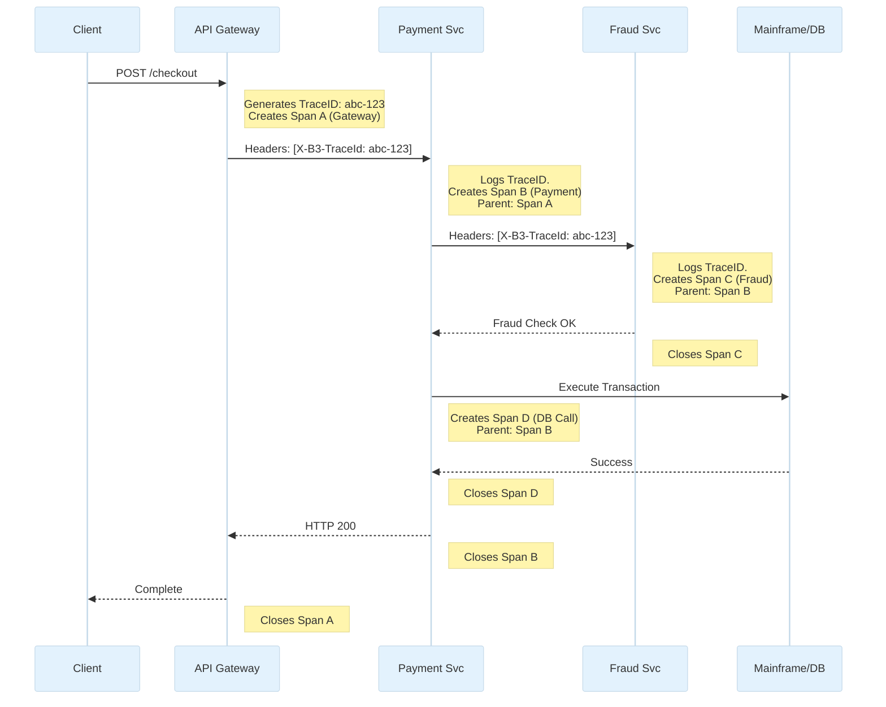

# Observability and Monitoring

## Overview

In a monolithic application, debugging is straightforward: open the single log file, search for the Exception stack trace, and fix the code. In a massive microservices architecture spanning 500 containers across multiple availability zones, a single user request might traverse 15 different services, 3 message queues, and 4 databases. If one of those services adds 800ms of latency, the user experiences a timeout.

How do you find which service caused the delay? You cannot simply "check the logs." 

For a Staff/Principal Engineer, building an observable system is non-negotiable. Observability is not just monitoring; it is the property of a system that allows you to understand its internal state simply by examining its external outputs. In enterprise banking, where strict Service Level Agreements (SLAs) dictate response times in the 99.99th percentile (P99.99), robust observability is the only way to prove you are meeting your contractual obligations.

## Foundational Concepts: The Three Pillars of Observability

A truly observable system requires three distinct but deeply integrated pillars of telemetry data.

### 1. Logs
A record of discrete events that happened in the application.
*   **Format**: Plain text (historically), but enterprise logging *must* be structured (JSON). A log message like `User 123 logged in from IP 1.2.3.4` is useless for analytics. A structured log `{"event": "login", "user_id": 123, "ip": "1.2.3.4", "status": "success"}` can be instantly queried and aggregated.
*   **Volume**: Massive. Logging every HTTP request across 500 services can generate terabytes of data per day.
*   **Tooling**: Logstash/Fluentd (Collectors), Elasticsearch (Storage/Search), Kibana (Visualization) — The ELK/EFK Stack. Or managed services like Splunk or Datadog.

### 2. Metrics
Numerical representations of data measured over intervals of time.
*   **Format**: Time-series data points (e.g., `cpu_usage{host="server-1"} 85.5 1678886400`).
*   **Purpose**: Metrics are incredibly cheap to store compared to logs. They are used for dashboards, alerting, and trend analysis. You do not log every successful HTTP 200 request; you simply increment a counter metric (`http_requests_total`).
*   **The USE Method (Resources)**: Measure Utilization, Saturation, and Errors for infrastructure.
*   **The RED Method (Services)**: Measure Rate (requests/sec), Errors (failed requests/sec), and Duration (latency distribution) for microservices.
*   **Tooling**: Prometheus (Time-Series Database & Scraper), Grafana (Dashboards).

### 3. Distributed Tracing
Tracks a single request as it flows across network boundaries through multiple microservices.
*   **The Problem**: A slow checkout flow. Is the delay in the API Gateway, the Payment Service, or the slow database query inside the Fraud Service?
*   **The Solution**: When a request enters the system, the edge gateway generates a unique `Trace ID` and injects it into the HTTP headers (e.g., `X-B3-TraceId`). Every service that receives this request logs the `Trace ID` and passes it along to downstream services. Each individual hop or operation is recorded as a `Span` with a start and end time.
*   **Tooling**: OpenTelemetry (The modern standard for instrumentation), Jaeger / Zipkin (Tracing Backends).

## Technical Deep Dive

### Service Level Objectives (SLOs) and Error Budgets

Staff Engineers don't just set alerts for "CPU > 80%." High CPU is not a business problem; slow response times are.
*   **Service Level Indicator (SLI)**: A carefully defined quantitative measure of some aspect of the level of service. (e.g., The proportion of HTTP GET requests to `/api/balances` that return HTTP 200 within 100ms).
*   **Service Level Objective (SLO)**: A target value or range of values for a service level that is measured by an SLI. (e.g., 99.9% of all requests measured by the SLI will succeed in a 30-day window).
*   **Error Budget**: If our SLO is 99.9%, we have an allowance of 0.1% failure (about 43 minutes of downtime/slowness per month). If the product team continually pushes buggy code and burns the error budget to 0, all feature deployments are frozen. The team *must* focus solely on reliability engineering until the budget replenishes.

### Percentiles (P90, P99, P99.9) vs. Averages

Never use averages to measure latency.
*   **The Flaw of Averages**: If 99 users experience a 10ms response time, and 1 user experiences a 10-second (10,000ms) database timeout, the average response time is 109ms. The system looks "fast" on a dashboard, masking the fact that a user's transaction failed catastrophically.
*   **Percentiles (Latency Distributions)**:
    *   **P50 (Median)**: 50% of requests are faster than this. Used to understand the typical user experience.
    *   **P95 / P99**: 95% / 99% of requests are faster than this. Used to define SLAs and find outlier performance issues (like JVM Garbage Collection pauses). In banking, if your P99 latency is high, you are failing your most active (and usually most profitable) algorithmic trading customers.

## Visual Representations

### Distributed Tracing Context Propagation



### The RED Method Dashboard Architecture

```mermaid
flowchart TD
    classDef metrics fill:#C8E6C9,stroke:#388E3C,stroke-width:2px;
    classDef storage fill:#FFF9C4,stroke:#FBC02D,stroke-width:2px;
    classDef dash fill:#FFCCBC,stroke:#E64A19,stroke-width:2px;

    App[Microservice \n (Exposes /metrics endpoint)]:::metrics

    Prometheus[(Prometheus TSDB)]:::storage
    Grafana[Grafana Dashboard]:::dash
    Alert[Alertmanager]:::dash

    Prometheus -->|Scrapes every 15s| App
    
    Grafana -->|PromQL queries| Prometheus
    
    Prometheus -->|Evaluates Rules| Alert
    Alert -->|Fires| PagerDuty[PagerDuty / Slack]:::dash
    
    note bottom of Grafana: RED Metrics Visualized:<br/>1. Rate: 5,000 req/sec<br/>2. Errors: 12 HTTP 5xx/sec<br/>3. Duration: P99 = 450ms
```

## Code/Configuration Examples

### Structured JSON Logging (Java/Logback)

Using classic unstructured logs (`PatternLayout`) makes searching in Splunk/Elasticsearch difficult. High-performing teams configure JSON logging so every required context field is easily indexed.

```xml
<!-- logback-spring.xml -->
<configuration>
    <!-- Use LogstashEncoder to output strictly formatted JSON -->
    <appender name="JSON_STDOUT" class="ch.qos.logback.core.ConsoleAppender">
        <encoder class="net.logstash.logback.encoder.LogstashEncoder">
            <!-- Include MDC (Mapped Diagnostic Context) automatically -->
            <includeMdc>true</includeMdc>
            <!-- Add static context to every log line -->
            <customFields>{"app_name":"payment-service", "env":"production"}</customFields>
        </encoder>
    </appender>

    <root level="INFO">
        <appender-ref ref="JSON_STDOUT" />
    </root>
</configuration>
```

### Injecting Trace IDs via MDC (Spring Boot)

When handling an incoming WebFlux/MVC request, extract the Correlation ID from the header and place it in the Mapped Diagnostic Context (MDC). The logging framework will automatically append it to every subsequent `log.info()` call made by that thread.

```java
@Component
public class TraceIdFilter extends OncePerRequestFilter {

    private static final String TRACE_HEADER = "X-Correlation-Id";

    @Override
    protected void doFilterInternal(HttpServletRequest request, 
                                    HttpServletResponse response, 
                                    FilterChain filterChain) throws ServletException, IOException {
        
        // 1. Extract from caller, or generate a new one if this is the entry point
        String traceId = request.getHeader(TRACE_HEADER);
        if (traceId == null || traceId.isEmpty()) {
            traceId = UUID.randomUUID().toString();
        }

        try {
            // 2. Add to MDC. The LogstashEncoder will now inject this into the JSON
            MDC.put("trace_id", traceId);
            
            // 3. Add it to the response headers for the client's reference
            response.addHeader(TRACE_HEADER, traceId);
            
            // 4. Continue the filter chain
            filterChain.doFilter(request, response);
        } finally {
            // 5. CRITICAL: Always clear the MDC to prevent thread-pool pollution
            MDC.remove("trace_id");
        }
    }
}
```

## Interview Questions & Model Answers

**Q1: Our microservices architecture spans 50 physical servers. A specific user complains that their payment failed, but you don't know which service failed. How do you find the error?**
*Answer*: This scenario requires centralized, aggregated structured logging and Distributed Tracing. When the user initiated the payment, the API Gateway or edge proxy should have generated a unique `Trace ID` (or `Correlation ID`). This ID must be injected into the HTTP headers of every downstream service call (e.g., Gateway -> Payment Service -> Fraud Service), and deeply integrated into the MDC (Mapped Diagnostic Context) of the application so that every log line written relates to that transaction includes `{"trace_id": "123"}`.
I would open our centralized log aggregator (Splunk, Datadog, or Elasticsearch) and perform a simple query: `trace_id: "123" AND level: "ERROR"`. This will instantly return the exact microservice (e.g., the Fraud Service) and the specific stack trace that caused the failure, without me having to SSH into 50 different servers.

**Q2: We want to set up an alert for our new REST API. Should we alert if CPU exceeds 90% or if memory exceeds 80%?**
*Answer*: Neither. Alerting on infrastructure metrics (CPU/Memory) is an anti-pattern known as "Cause-Based Alerting." High CPU utilization is perfectly normal during a load spike; if the system is designed correctly, it should autoscale, and the users will notice nothing. Alerting an engineer at 2 AM for high CPU causes alert fatigue.
Instead, we must use "Symptom-Based Alerting" utilizing the RED method (Rate, Errors, Duration). We should alert if the Error rate (HTTP 5xx) spikes above 1% within a 5-minute window, or if the P99 Duration (latency) exceeds 500ms. These are symptoms that explicitly indicate the user experience is currently degraded. The engineer who is paged will *then* look at the CPU/Memory dashboard to diagnose the cause.

**Q3: What is the "Thundering Herd" problem in monitoring, and how does Prometheus's architecture prevent it?**
*Answer*: In older monitoring systems (like Nagios/Zabbix or statsd), the application "pushes" metrics to a central monitoring server. If you have 5,000 microservice instances, and they all push a heavy payload of data every 10 seconds to the monitoring server, the network and the server will collapse under the load (a Thundering Herd). 
Prometheus prevents this by using a "Pull" architecture. Prometheus sits outside the applications and systematically scrapes an HTTP `/metrics` endpoint exposed by each pod. Prometheus controls the cadence, interval, and concurrency of the scrapes. If the Prometheus server is overwhelmed, it simply slows down its scraping pace. If an application pod crashes completely, Prometheus knows instantly because the scrape fails, whereas a push-based system wouldn't know if the app died or was simply idle.

**Q4: Explain the difference between tracing and logging. When would you use one over the other?**
*Answer*: Logging records isolated, discrete events (`Payment successful` or `NullPointerException at Line 42`). Logging provides massive depth and context about exactly why a specific function failed locally.
Tracing maps the causal relationship and latency profile of a request across distributed network boundaries. It provides breadth. 
If an entire API endpoint is responding slowly (P99 latency is 4 seconds), looking at logs won't easily tell me if the delay is in the database, the network hop, or a third-party API call. I would open the Distributed Trace (in Jaeger/Zipkin) to see a visual waterfall graph (Gantt chart) of the spans. I might see that the `Fraud Check Span` took 3.8 seconds. *Then*, I would grab the related `Trace ID` and query the logs for the Fraud Service to find the precise SQLException that caused the delay. They are highly complementary tools.

## Real-World Enterprise Scenarios

**Scenario: Designing for High Cardinality Metrics**
*   **Context**: A developer adds a new metric to Spring Boot: `http_requests_total{endpoint="/api/users", customer_id="12345"}`. 
*   **The Disaster**: The platform has 10 million customers. This creates 10 million unique time-series data streams (High Cardinality). Prometheus tries to store 10 million new indices in memory, exhausts its RAM, and crashes the entire monitoring cluster. You lose visibility into the entire bank because of one line of code.
*   **The Solution**: Strict architectural rules forbidding unbounded labels in metrics. Labels must represent a small, finite set of values (e.g., `status="200"`, `method="GET"`, `region="us-east"`). If you need to track individual customer behavior, you cannot use metrics. You must write an event to a Log stream or a structured database (like ClickHouse or Snowflake) designed for high-cardinality aggregation.

## Common Pitfalls & Best Practices

**Pitfalls:**
*   **Alert Fatigue**: Configuring PagerDuty to send critical alerts to engineers for non-critical issues (e.g., "Node disk space at 70%"). Engineers will eventually mute the channel or ignore it, and when a real production outage occurs, nobody will respond.
*   **Silently Dropping Errors**: A `catch (Exception e)` block that does nothing or logs a generic message without the stack trace or context. It renders the system a black box.
*   **Scraping Too Aggressively**: Configuring Prometheus to scrape thousands of JVM applications every 1 second. Gathering JMX/Micrometer metrics is a CPU-intensive operation. Scraping too often can actually crash the application you are trying to monitor. Use 15-30 second intervals.

**Best Practices:**
*   **The "Golden Signals"**: Focus heavily on the Google SRE 4 Golden Signals for user-facing systems: Latency, Traffic, Errors, and Saturation.
*   **Treat Logs as Immutable Event Streams**: Applications should not manage log files or rotation. Applications cleanly write JSON to `stdout`/`stderr`. The infrastructure (Docker/Kubernetes) captures the streams and forwards them securely to the aggregation platform.
*   **OpenTelemetry**: Standardize on OpenTelemetry (OTel) for all instrumentation. Avoid vendor lock-in by using OTel SDKs so you can seamlessly switch your backend from Datadog to Splunk to Honeycomb without altering thousands of lines of application code.

## Comparison Tables

| Pillar | Focus | Format | Cardinality Support | Cost Profile |
| :--- | :--- | :--- | :--- | :--- |
| **Logs** | Deep debugging, context, audit | JSON / Text lines | Infinite (Any string) | Very High (Expensive to store long-term) |
| **Metrics** | Alerting, trends, dashboards | Time-series numbers| Low/Bounded only | Very Low (Highly compressed) |
| **Traces** | Request flow, latency bottlenecks| Tree of Spans | Medium (Trace IDs) | Medium (Usually relies on heavy sampling) |

| Metric Methodology | Target Use Case | Key Metrics Tracked |
| :--- | :--- | :--- |
| **RED** | Microservices / APIs | Rate, Errors, Duration |
| **USE** | Infrastructure (Nodes, Disks)| Utilization, Saturation, Errors |
| **Four Golden Signals**| End-to-end SRE | Latency, Traffic, Errors, Saturation |

## Key Takeaways

*   **Symptom-based Alerting**: Alert on SLAs and user pain (HTTP 500s, Latency), not infrastructural symptoms (CPU, Memory).
*   **High Cardinality kills Prometheus**: Never put `user_id` or unique `transaction_id`s as labels in time-series metrics.
*   **Distributed Tracing is mandatory for Microservices**: Without `X-Correlation-Id` header propagation, debugging a multi-hop architecture is impossible.
*   **Structured JSON Logging**: Standardize application logs to output JSON with deep contextual fields (env, service_name, pod_name, trace_id) for rapid aggregation and searching.

## Further Reading
*   [Google Site Reliability Engineering (SRE) Book](https://sre.google/sre-book/monitoring-distributed-systems/) (The industry standard manual on SLOs and Error Budgets).
*   [Tom Wilkie's RED Method](https://www.weave.works/blog/the-red-method-key-metrics-for-microservices-architecture/)
*   [OpenTelemetry Documentation](https://opentelemetry.io/docs/)
*   [Brendan Gregg's USE Method](https://www.brendangregg.com/usemethod.html)
