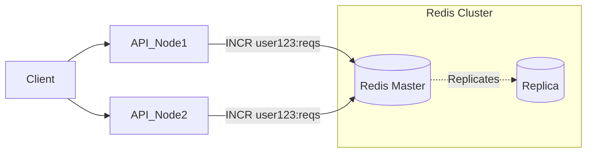

# Case Study: URL Shortener & Rate Limiter

## Overview

Designing a URL Shortener (like TinyURL or Bitly) is the "Hello World" of System Design interviews. However, for a Staff/Principal Engineer, the interviewer is not looking for a basic CRUD application. They are evaluating your ability to handle massive scale, predict hash collisions, perform back-of-the-envelope capacity planning, and implement database partitioning. 

To elevate the complexity to a Staff level, interviewers often combine this with designing a **Distributed Rate Limiter**. A rate limiter protects the API from abuse (e.g., stopping a malicious actor from generating millions of shortened URLs per second and bankrupting your database). 

In enterprise banking, this pattern is identical to generating unique, secure, unguessable payment link URLs or one-time secure document vaults, and rate-limiting the creation of those resources.

---

## Part 1: Design a URL Shortener

### 1. Requirements Clarification
*   **Functional:**
    *   Given a long URL, return a much shorter, unique alias (e.g., `bit.ly/3x8fA`).
    *   When users click the short link, redirect them to the original URL.
    *   *Custom Alias*: Users can optionally choose their own short link.
    *   *Expiration*: Links expire after a configurable time (default 5 years).
*   **Non-Functional:**
    *   **High Availability**: If the redirect service goes down, links die. (Availability > Consistency).
    *   **Low Latency**: Redirects must happen in less than 10ms.
    *   **High Scalability**: We expect 100 million new URLs generated per month. Read-to-Write ratio is 100:1 (10 billion redirects per month).

### 2. Back-of-the-Envelope Estimation (Capacity Planning)
*   **Write QPS**: 100 Million / (30 days * 24h * 3600s) ≈ **40 URLs/second**.
*   **Read QPS**: 100:1 ratio. 40 * 100 = **4,000 Redirects/second**.
*   **Storage (5 Years)**: 
    *   100M URLs/month * 60 months = 6 Billion total records.
    *   Average record size: 2KB (Hash, Long URL, UserID, CreationDate).
    *   6 Billion * 2KB = **12 Terabytes (TB)** of database storage.
*   **Cache (20% of daily reads)**:
    *   Daily reads: 4000 QPS * 86,400 seconds = 345 Million reads/day.
    *   20% cache hit requirement: 69 Million records in cache.
    *   69M * 2KB = **~138 GB of RAM** required for Redis/Memcached.

### 3. High-Level Architecture

```mermaid
flowchart TD
    Client[User / Browser]
    
    LB[Load Balancer]
    API[API Gateway / Rate Limiter]
    
    Cache[(Redis Cluster \n 138GB)]
    
    subgraph Services
        WriteSvc[Write Service \n (Shorten URL)]
        ReadSvc[Read Service \n (Redirect)]
        IDGen[Distributed ID Generator \n (e.g., Snowflake)]
    end
    
    DB[(Distributed NoSQL DB \n Cassandra / DynamoDB)]

    Client -->|1. GET or POST| LB
    LB --> API
    
    API -->|GET /alias| ReadSvc
    ReadSvc -->|Check Cache| Cache
    ReadSvc -.->|Cache Miss| DB
    
    API -->|POST /shorten| WriteSvc
    WriteSvc -->|Request Unique ID| IDGen
    WriteSvc -->|Save Mapping| DB
```

### 4. Deep Dive: Hashing & ID Generation

How do we generate a unique, short string (`3x8fA`)?

*   **Approach A: Hash Function (MD5/SHA256)**
    *   Hash the long URL: `MD5(https://verylong.com/...)` -> `1a2b3c4d5e...`
    *   Take the first 7 characters. Base62 encode it.
    *   *Problem*: **Collisions**. Two different URLs might hash to the exact same 7 characters. You must check the DB first, and if a collision exists, append a random string to the URL and hash again. Highly inefficient at scale.
*   **Approach B: Base62 Conversion (The Enterprise Way)**
    *   Use a Distributed ID Generator (like Twitter Snowflake) or a highly-available relational Database Sequence (auto-incrementing integer) to get a guaranteed unique, globally sequential integer (e.g., `125,489,101`).
    *   Convert that Base10 integer into Base62 (using `[a-z, A-Z, 0-9]`). 
    *   A 7-character Base62 string can represent exactly $62^7 = 3.5$ Trillion unique URLs. More than enough for 5 years.
    *   *No collisions, no database read-before-write.*

### 5. Deep Dive: Database Schema & Scaling

*   **Why NoSQL (Cassandra / DynamoDB)?**
    *   We need to store 12TB of data. A single Postgres instance maxes out around here without complex sharding.
    *   The data model is incredibly simple: Key-Value. There are no relational joins between records (unless a user wants analytics on their links, which is a separate system).
    *   We need massive, predictable read performance and easy horizontal horizontal scaling. AP over CP.

*   **The Cassandra Schema:**
    ```sql
    CREATE TABLE url_mappings (
        short_url text PRIMARY KEY,   -- Partition Key (Blazing fast lookups)
        long_url text,
        created_at timestamp,
        expires_at timestamp
    );
    ```

### 6. Deep Dive: The HTTP Redirect

When the user queries the `Read Service`, how does the redirect work?
*   **HTTP 301 (Moved Permanently)**: The browser caches the response. The next time the user clicks `bit.ly/abc`, the browser routes them directly to the long URL without hitting our servers. Great for reducing server load, but *impossible* to track analytics (click rates).
*   **HTTP 302 (Found / Temporary)**: The browser *does not* cache the response. Every click hits our server. Required if the product demands tracking analytics, geo-location of clicks, or dynamic routing based on device type.

---

## Part 2: Design a Distributed Rate Limiter

The API Gateway must forcefully reject requests (HTTP 429 Too Many Requests) if a single user calls `/shorten` more than 5 times per second.

### 1. Requirements Clarification
*   Rate limit by User ID or IP Address.
*   Must be distributed (the API Gateway has 50 instances; they must share the limit count).
*   Extremely low latency (cannot add 50ms to every API call).

### 2. Rate Limiting Algorithms
*   **Token Bucket**: The most common. A bucket holds tokens (e.g., 5 tokens). Tokens are added at a fixed rate (5 per second). A request costs 1 token. If the bucket is empty, drop the request. Allows for sudden bursts.
*   **Leaky Bucket**: Requests enter a queue. A background worker pulls requests out of the queue at a strict, constant rate. Smooths out traffic, but bursts are delayed.
*   **Fixed Window Counter**: Count requests in a strict window (e.g., 12:00:00 to 12:01:00).
    *   *The Problem*: The Spike at the Edge. If the limit is 10/min, a user can send 10 requests at 12:00:59, and 10 more at 12:01:01. They bypassed the limit, sending 20 requests in a 2-second span.
*   **Sliding Window Log**: Stores the exact timestamp of every request in Redis. Blisteringly accurate, but consumes massive amounts of RAM (you store 1 million timestamps for high-volume users).
*   **Sliding Window Counter**: The enterprise optimized blend. Combines Fixed Window counters with calculated weightings to smooth out the edge spikes without storing millions of timestamps.

### 3. Distributed Architecture (Redis)

We cannot use an in-memory counter (like a Java `ConcurrentHashMap`) inside a single API Gateway pod, because User A's 5 requests might be load-balanced across 5 different pods.

We must use an external, centralized cache: **Redis**.



### 4. Deep Dive: The Race Condition (Concurrency)

If the API Gateway reads the Redis counter (`GET`), increments it locally, and writes it back (`SET`), two pods checking User A's limit simultaneously will read `4`, both increment to `5`, and both write `5`. The user got 6 requests.

**The Solution:**
1.  **Redis INCR**: Use atomic operations like `INCR`, which increments the counter and returns the new value in a single, thread-safe step.
2.  **Lua Scripts**: Upload a small Lua script to Redis. Redis executes Lua scripts sequentially and atomically. The script can check the Token Bucket limit, decrement the tokens, and update the timestamp without any other client interfering.

### 5. Deep Dive: Performance Bottlenecks

A network call to Redis takes 1-2ms. Is that acceptable for every single API request on the Gateway? Adding 2ms to 100,000 QPS is massive overhead.

**Optimization (Eventual Consistency / Local Synch):**
*   Instead of hitting Redis for *every* request, the API Gateway node maintains a local, in-memory counter (using Guava or Caffeine cache).
*   Every 1 second, it asynchronously batches its local counts and syncs them to Redis.
*   *Trade-off*: A user allowed 5 requests might get 7 or 8 requests during that brief 1-second sync window. In banking (e.g., brute-forcing a PIN), strict accuracy is required (use strict Lua scripts). For URL shortening, slight eventual consistency is perfectly acceptable.

---

## Interview Questions & Model Answers

**Q1: In the URL shortener, how do you handle deleting expired links from the multi-terabyte Cassandra database?**
*Answer*: Deleting records row-by-row in Cassandra generates "tombstones," which severely degrade read performance over time because Cassandra is an append-only architecture.
Instead of a background batch job running `DELETE FROM urls WHERE expires_at < NOW()`, I would use Cassandra's native **TTL (Time to Live)** feature. When we `INSERT` the row, we set `TTL = 157680000` (5 years in seconds). Cassandra will automatically handle the graceful cleanup and tombstoning at the lowest level of the storage engine during SSTable compaction, requiring zero application logic or performance overhead on our end.

**Q2: We are launching a marketing campaign. We generated a short link for our Super Bowl ad, and 10 million people will click it in the next 60 seconds. Our read latency is normally 10ms, but suddenly jumps to 5000ms. What happened, and how do you fix it?**
*Answer*: This is a classic **Cache Stampede (Thundering Herd)**. The 10 million users hit the read service. If that specific short URL is not in the Redis cache, all 10 million requests will simultaneously see a "Cache Miss," bypass Redis, and hit the backend Cassandra database with identical `SELECT` queries, instantly crashing it.
To fix this, we must implement **Distributed Locking (Mutex)** on the cache miss path. When the first request misses the cache, it acquires a Redis lock for that specific short URL. The single thread queries Cassandra, updates the Redis cache, and releases the lock. The other 9,999,999 concurrent threads see the lock, briefly pause, and then read the successfully populated value from the cache, completely protecting the database.

**Q3: Describe how the Token Bucket rate limiter interacts with HTTP Headers to guide the client.**
*Answer*: A well-architected API gracefully tells the client precisely what is happening. When a request traverses the API Gateway, the gateway checks the Token Bucket. 
If the request is successful, it should return HTTP `200 OK` and attach headers:
*   `X-Ratelimit-Remaining: 4` (You have 4 requests left)
*   `X-Ratelimit-Limit: 5` (Your total tier limit)
If the bucket is empty, it returns HTTP `429 Too Many Requests` and a crucial header:
*   `X-Ratelimit-Retry-After: 30` (Wait 30 seconds before hitting the API again, because that is when the bucket refills). This strictly dictates client behavior and prevents aggressive polling.

## Key Takeaways

*   **Offline Base62 Generation**: Never rely on real-time MD5 hashing and collision-checking for URLs. Pre-generate massive blocks of sequential integers (using Zookeeper/Snowflake) and mathematically convert them to Base62 strings.
*   **301 vs 302**: Master the difference between permanent caching and temporary redirects based on the business tracking requirements.
*   **Atomic Rate Limiting**: You must execute rate-limiting checks atomically using Redis `INCR` or Lua scripts to prevent concurrent bypasses.
*   **Local Caching**: The API Gateway should use eventual consistency (syncing local counts to Redis asynchronously) to avoid adding 2ms of Redis network latency to every single API call, provided the business tolerates slight over-allowances.
