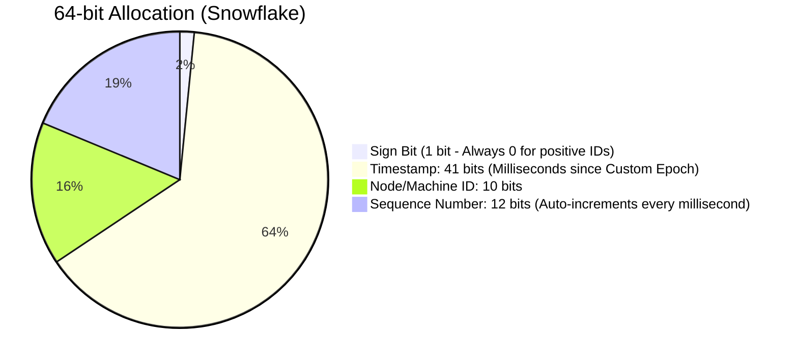

# Case Study: Distributed Cache & Unique ID Generator

## Overview

Designing a Distributed Cache (like Redis or Memcached) and a Distributed Unique ID Generator (like Twitter Snowflake) are classic systems design interview questions that probe your understanding of low-level data structures, network partitioning, and consensus protocols.

These are not application-level problems; they are infrastructural problems. 
In enterprise banking, almost every microservice depends on a reliable, globally unique transaction ID to ensure idempotency across ledgers. If your ID generator creates a duplicate ID, you have corrupted the ledger. Similarly, if your distributed cache loses data due to a poorly implemented hash ring during a node failure, a "cache stampede" will instantly obliterate your core relational database.

For a Staff/Principal engineeer, you must be able to design these systems from the ground up, explaining the math behind consistent hashing and bitwise operations.

---

## Part 1: Design a Distributed Cache

### 1. Requirements Clarification
*   **Functional:**
    *   `PUT(key, value)` and `GET(key)` operations.
    *   Values are byte arrays (binary safe) up to 1MB.
    *   Eviction policy when memory is full (e.g., LRU - Least Recently Used).
*   **Non-Functional:**
    *   **Low Latency**: < 1ms internal response time.
    *   **High Scalability**: Supports hundreds of Terabytes of data distributed across thousands of commodity servers.
    *   **High Availability**: Must survive the failure of arbitrary cache nodes.

### 2. High-Level Architecture (The Proxy Model vs. Smart Client)

How does a client know *which* server out of 500 contains the key `"user:123"`?
*   **Smart Client (Memcached model)**: The library imported into the Java application contains the routing logic. It hashes `"user:123"` -> Node 14. It establishes a TCP connection directly to Node 14. Fastest, but requires updating 5,000 microservices if the routing logic changes.
*   **Proxy-Based (Twemproxy/Envoy model)**: The client connects to a dumb local proxy (`localhost:11211`). The proxy maintains the open TCP connections to all 500 backend cache servers, hashes the key, and transparently forwards the request. Easier to manage centrally.

### 3. Deep Dive: Routing & Consistent Hashing

*   **The Modulo Problem**: 
    If we have 4 servers, we route a key using modulo: `hash(key) % 4`. 
    If Server 3 crashes, we now have 3 servers. The formula is now `hash(key) % 3`. 
    *Disaster*: Every single key hashes to a different server. $99\%$ of the cluster experiences a cache miss instantly. The database crashes.

*   **Consistent Hashing (The Solution)**:
    We imagine a mathematical ring from $0$ to $2^{32}-1$.
    1. We hash the IP addresses of our 4 servers and place them randomly on this ring (e.g., Server A is at 100, Server B at 300).
    2. We hash the actual caching key (e.g., `hash("user:123")` = 150).
    3. The client maps the key onto the ring at 150, walks "clockwise" around the ring, and stops at the very first server it hits (Server B at 300).
    *   *Node Failure*: If Server B crashes, only the keys belonging to the arc *between A and B* are orphaned. The client simply walks further along the ring to Server C. Only 25% of the cache misses instead of 99%.

*   **Virtual Nodes (Handling Hotspots)**: 
    What if Server A is physically placed right next to Server B on the mathematical ring? Server B receives almost zero traffic. 
    To ensure an even load distribution, we hash each server 100 times (e.g., `hash(ServerA_01)`, `hash(ServerA_02)`), scattering "Virtual Nodes" evenly across the entire ring.

### 4. Deep Dive: Eviction Policies (LRU)

A Node runs out of RAM. How do we eject old data instantly in $O(1)$ time to make room for new data?

*   **Data Structure**: A combination of a **HashMap** and a **Doubly Linked List**.
    1.  The `HashMap` gives us $O(1)$ lookup time to find the value by Key. But HashMaps lack order.
    2.  The `Doubly Linked List` (Head -> Tail) tracks recency.
*   **The Algorithm**:
    *   `GET("user:123")`: We find the node in the HashMap. We immediately detach it from its current position in the Linked List and move it to the **Head** (Most Recently Used).
    *   `PUT("new_data")`: If the cache is full, we look at the **Tail** of the Linked List (Least Recently Used). We delete it from the HashMap and the list, freeing memory. We then insert `"new_data"` at the Head.

---

## Part 2: Design a Distributed Unique ID Generator

In a banking system, generating the `transaction_id` for a ledger entry must be globally unique across all 50 microservices, strictly ordering time, and completely unguessable.

### 1. Requirements Clarification
*   **Unique**: Mathematical impossibility of generating a duplicate ID.
*   **Sortable by Time**: IDs generated later should be larger than IDs generated earlier (crucial for database indexing performance and pagination).
*   **64-bit Integer**: Must fit in a standard SQL `BIGINT` column (8 bytes) for blazing-fast indexing. (UUIDs are 128-bit strings, take up twice the space, and destroy B-Tree clustering performance because they are completely random, causing massive page fragmentation).
*   **Highly Available**: Must generate 10,000 IDs per second.

### 2. Algorithms That Fail at Scale

*   **Database Auto-Increment**: `INSERT INTO ids VALUES()`. A single DB is a massive Single Point of Failure (SPOF) providing terrible latency. If we run multiple DBs (shards), how do we guarantee uniqueness?
*   **UUID**: `550e8400-e29b-41d4-a716...` Guaranteed unique, but 128-bits string. Not sortable. Ruins relational database performance.
*   **Ticket Server (Flickr's Model)**: A centralized DB handing out blocks of IDs to application servers. Still a single point of failure (if the master DB crashes, ID generation halts for the entire company).

### 3. The Enterprise Solution: Twitter Snowflake

Snowflake generates a 64-bit signed integer. The 64 bits are divided mathematically to guarantee uniqueness without any network coordination between servers.



#### How It Works:
1.  **Timestamp (41 bits)**: Captures the precise millisecond.
    *   41 bits can hold $2^{41} - 1$ milliseconds. Approximately 69 years.
    *   Instead of using the standard UNIX epoch (1970), we set a custom epoch (e.g., Jan 1, 2024=0) to maximize the 69-year runway.
2.  **Machine/Node ID (10 bits)**: Identifies exactly *which* microservice pod generated the ID.
    *   10 bits = $2^{10}$ = 1,024 unique servers. (Configured at boot via Zookeeper or Kubernetes Pod Ordinal Index).
    *   This guarantees that Server 1 and Server 2 can mathematically *never* produce the same ID, even if they operate at the exact same millisecond. No network coordination required!
3.  **Sequence Number (12 bits)**: What if Server A needs to generate 5 IDs in the exact same millisecond?
    *   12 bits = $2^{12}$ = 4,096 IDs per millisecond.
    *   A local memory counter simply increments from 0 to 4095. If Server A tries to generate a 4,097th ID in that same millisecond, the thread loop simply `sleeps` for 1 millisecond and resets the counter to zero.

### 4. Code Implementation (Snowflake in Java)

Interviewers occasionally ask you to sketch the bitwise logic for Snowflake to prove you understand low-level operations.

```java
public class SnowflakeIdGenerator {
    // Custom Epoch (Jan 1, 2024)
    private static final long EPOCH_START = 1704067200000L;
    
    // Bit lengths
    private static final long NODE_ID_BITS = 10L;
    private static final long SEQUENCE_BITS = 12L;
    
    // Max values we can represent
    private static final long MAX_NODE_ID = -1L ^ (-1L << NODE_ID_BITS); // 1023
    private static final long SEQUENCE_MASK = -1L ^ (-1L << SEQUENCE_BITS); // 4095
    
    // Bit shifts (Moving the timestamp left by 22 bits (10 + 12))
    private static final long WORKER_ID_SHIFT = SEQUENCE_BITS;
    private static final long TIMESTAMP_SHIFT = SEQUENCE_BITS + NODE_ID_BITS;

    private long nodeId;
    private long sequence = 0L;
    private long lastTimestamp = -1L;

    public SnowflakeIdGenerator(long nodeId) {
        if (nodeId > MAX_NODE_ID || nodeId < 0) {
            throw new IllegalArgumentException("Node ID must be between 0 and " + MAX_NODE_ID);
        }
        this.nodeId = nodeId;
    }

    public synchronized long nextId() { // Synchronized for thread-safety within the microservice instance
        long timestamp = System.currentTimeMillis();

        if (timestamp < lastTimestamp) {
            throw new RuntimeException("Clock moved backwards. Refusing to generate ID"); // NTP Synchronization Issue
        }

        if (timestamp == lastTimestamp) {
            // Same millisecond, increment the sequence
            sequence = (sequence + 1) & SEQUENCE_MASK;
            if (sequence == 0) {
                // We generated 4096 IDs in 1 ms. Exhausted the 12 bits. Block until the next millisecond.
                timestamp = waitNextMillis(lastTimestamp);
            }
        } else {
            // New millisecond, reset sequence to 0
            sequence = 0L;
        }

        lastTimestamp = timestamp;

        // The Bitwise OR assembly: (Time << 22) | (NodeId << 12) | (Sequence)
        return ((timestamp - EPOCH_START) << TIMESTAMP_SHIFT) |
               (nodeId << WORKER_ID_SHIFT) |
               sequence;
    }

    private long waitNextMillis(long lastTimestamp) {
        long currentTimestamp = System.currentTimeMillis();
        while (currentTimestamp <= lastTimestamp) {
            currentTimestamp = System.currentTimeMillis();
        }
        return currentTimestamp;
    }
}
```

---

## Interview Questions & Model Answers

**Q1: What happens to a Snowflake cluster if the physical hardware clock on Server A undergoes an NTP sync and jumps backward by 10 milliseconds?**
*Answer*: This is a huge, critical flaw in Snowflake generators. If the clock jumps backwards, the `System.currentTimeMillis()` will generate a timestamp identical to one it generated 10 milliseconds ago. Because we reset the local sequence counter back to `0`, the server is mathematically guaranteed to generate duplicate IDs, corrupting our database primary keys.
To mitigate this, the generator code must strictly track the `lastTimestamp`. If the current time is less than `lastTimestamp`, the thread must absolutely halt execution (`throw Exception` or sleep) until the physical clock catches back up to the high watermark.

**Q2: In a distributed cache, our "Promotional Campaign List" key expires at exactly 12:00 PM. 500,000 users are hitting it per second. What happens when the key expires, and how do we prevent a database crash?**
*Answer*: This is a classic "Cache Stampede" or "Thundering Herd." At exactly 12:00:01, 500,000 threads will check Memcached, see a Cache Miss, and all 500,000 threads will immediately fire a heavy `SELECT` query at the database simultaneously to recreate the list, choking connection pools and crashing the DB servers.
To solve this, I would implement **Probabilistic Early Recomputation**. A random percentage of clients checking the cache around 11:59 AM will "win a lottery" and see a fake cache miss. That single winning thread will proactively reach out to the database, query the new promotional list, and overwrite the Memcached value *before* it formally expires, seamlessly resetting the TTL for everyone else. Alternative solution: A distributed Redis Mutex lock on cache misses.

**Q3: When configuring the 10 bits ($2^{10} = 1024$) for the Machine/Node ID in Snowflake, how do you actually assign a unique ID from 1 to 1024 to an autoscaling Kubernetes pod that spins up dynamically?**
*Answer*: We cannot hardcode the Node ID in `application.yml` because we have 50 identical pods. 
1.  **Zookeeper / etcd**: Upon boot, the Java application reaches out to Zookeeper and claims an ephemeral node ID. If the pod crashes, Zookeeper releases the ID.
2.  **Kubernetes StatefulSets**: (Simpler). If we deploy the ID Generator as a StatefulSet, K8s guarantees sequential and strictly deterministic pod hostnames (e.g., `id-generator-0`, `id-generator-1`). The application can execute a simple regex on its string hostname to extract the integer `0` or `1` and inject it directly into the Snowflake mathematical formula as the Node ID.

**Q4: We are building a payment link cache. Hackers are discovering that if they constantly hit our API with randomly generated UUID strings (`GET /links/a1b2...`), they receive a quick Cache Miss. Knowing the backend database query takes 100ms, they launch a DDOS attack with billions of random useless IDs, completely overwhelming the backend Postgres cluster with useless queries. What is this, and how do we defend against it?**
*Answer*: This is called a **Cache Penetration** attack. Because the malicious data doesn't exist, it is *never* cached. Therefore, 100% of malicious requests bypass Redis and strike the database.
To prevent this, we must implement a **Bloom Filter**. A Bloom Filter is a wildly memory-efficient, probabilistic data structure (an array of bits). We load every valid short link into the Bloom Filter at boot.
When a request comes in, we ask the Bloom Filter: "Does this string exist in our database?"
*   If the filter returns **NO**: It is 100% mathematically certain the link does *not* exist. We instantly drop the request at the Gateway layer with a `404 Not Found` without ever touching the database or Redis.
*   If the filter returns **YES**: The link *might* exist (false positive rate of 1%). We allow the request to proceed to the Cache and Database. This absorbs 99% of the malicious DDOS payload with practically zero CPU cost.

## Key Takeaways

*   **Snowflake over UUIDs**: Avoid 128-bit UUID strings in heavy-read relational databases due to B-Tree fragmentation. Use 64-bit Timestamp-sorted Snowflakes for massive indexing performance.
*   **Bitwise Assembly**: Understand how Timestamp, Machine ID, and Sequence are logically shifted (`<<`) and combined (`|`) to form a complete mathematical ID.
*   **Consistent Hashing eliminates mass-invalidation**: A modular hash (`% N`) causes total cache eviction when $N$ nodes changes. A hash ring ensures only keys mapping directly to the dead node are remapped.
*   **Bloom Filters**: Mandatory knowledge for protecting expensive databases against Cache Penetration DDOS attacks.
